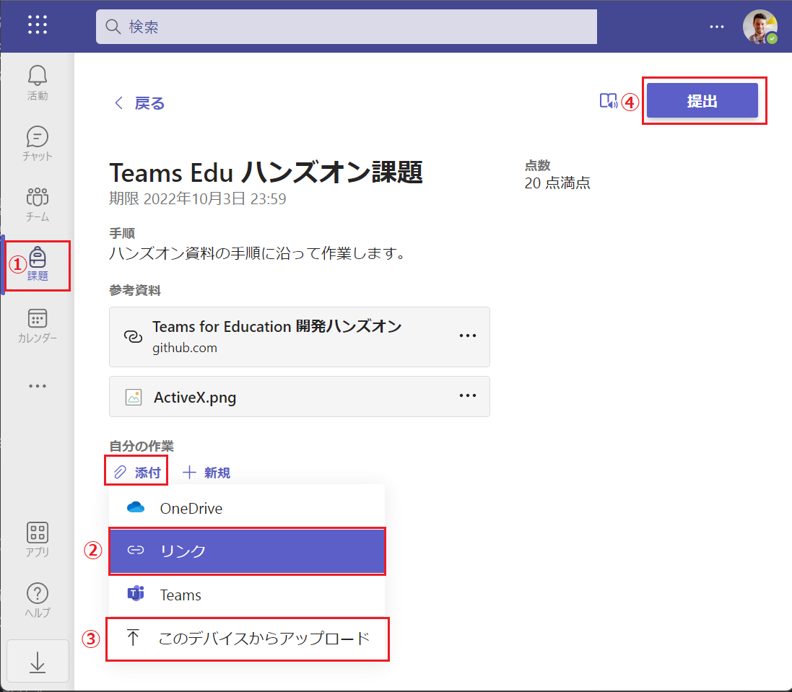

# 準備) 演習に入る前の準備 - 操作するリソースの作成
演習で操作するための Teams for Education のリソースを作成します。

この作業には Teams for Education はもちろん、リソースを作成するための管理者アカウントと、割り当てられた課題を提出するための生徒のアカウントが必要です。

生徒のアカウントは課題の提出やフィードバックの確認で使用しますので、サインイン可能な一般ユーザーのアカウントを 1 つご用意をお願いします。

  

## Teams for Education 固有のリソースの作成

Teams for Education 固有のリソースで、Graph API に[**教育機関 API**](https://learn.microsoft.com/ja-jp/graph/api/resources/education-overview?view=graph-rest-1.0) として用意されているもののいくつかについて、あらかじめ Teams for Education アプリケーションから作成しておきます。

これは演習の操作が既存のリソースに影響するのを避けるためと、演習 1 で使用する Graph エクスプローラーから権限の設定上作成できないものがあるためです。

  

## クラスの作成とメンバーの追加、課題の割り当て

クラスを作成して学生のメンバーを追加し、課題を作成して割り当てます。

手順は以下のとおりです。

### 手順

1. Microsoft Teams デスクトップ クライアントを起動するか、Web ブラウザーから [Web クライアント](https://teams.microsoft.com/) にアクセスし、Education 用のサブスクリプションの管理者アカウントでログインします

2. 画面左のメニューバーで \[**チーム**\] をクリックし、遷移した画面の左上の \[**チームに参加/チームを作成**\] ボタンをクリックします

    

3. \[チームに参加、またはチームを作成\] という画面に遷移するので、同画面の \[**チームを作成**\] というタイルにマウスをホバーさせ、表示された \[**チームを作成**\] ボタンをクリックします

4. \[チームの種類の選択\] ダイアログ ボックスが表示されるので **クラス** タイルをクリックします

5. \[チームを作成\] ダイアログボックスが表示されるので、各項目を以下のように設定して \[次へ\] ボタンをクリックします

    | 名前 | 説明 (オプション) |
    | ---- |---- |
    | ハンズオン| Teams for Education 用開発ハンズオン用 |

6. 作成中のクラスへのユーザーの追加画面に遷移するので、\[**学生**\] タブがアクティブになっていることを確認し、このハンズオンの演習を実施するユーザーがログイン可能なアカウントをドロップダウン リストボックスで検索し、\[**追加**\] ボタンをクリックします

7. \[**教職員**\] タブをアクティブにし、現在この作業を行っているアカウント以外で教職員が必要な場合は前のステップと同様の方法でアカウントを追加し、必要なければ \[**閉じる**\] ボタンをクリックしてダイアログ ボックスを閉じます

    なお、学生も教職員も後から追加/削除することができます

8. 作成したクラスの画面が表示されるので、同画面内の \[**課題**\] メニューをクリックし、遷移した右ペイン内の \[作成\] ボタンをクリックし、さらに表示された\[**課題**\] をクリックします

    

9. 課題の新規作成画面が表示されるので各項目を以下のように設定し、

    | 項目 | 設定値 |
    | ---- |---- |
    | タイトル | Teams Edu ハンズオン課題 |
    | 手順 | ハンズオン資料の手順に沿って作業します |
    | **添付**をクリック - \[**リンク**\] | Web アドレス(必須) : https://github.com/osamum/Easyway-for-MSTeams_edu-AppDev   表示するテキスト : "Teams for Education 開発ハンズオン"|
    | **添付**をクリック - \[**このデバイスからアップロード**\] | (任意の画像ファイルなどを選択)|
    | 点数 | 20 |
    | 割り当てるユーザー | Teams Edu ハンズオン/すべての受講者(※既定のまま) |
    | 期限日 | ※一週間後の日付を指定 |

    同画面左上の \[**割り当てる**\] ボタンをクリックします 

ここまでの手順で作成した課題が **Teams for Education 用開発ハンズオン用** クラスに追加して学生アカウントに割り当てられました。

  

## 割り当てられた課題の提出

Teams for Education に**学生のアカウント**でサインインし、前の手順で割り当てられた課題を提出します。

手順は以下のとおりです。

### 手順

1. Microsoft Teams デスクトップ クライアントを起動するか、Web ブラウザーから [Web クライアント](https://teams.microsoft.com/) にアクセスし、クラスに追加した学生のアカウントでログインします

2. 参加しているチームの一覧が表示されるので、前の手順で作成したチーム \[**Teams Edu ハンズオン**\] のタイルをクリックします

3. 画面左のメニューバーの \[**課題**\] をクリックすると割り当てられた課題の一覧が表示されるので前の手順で作成した **Teams Edu ハンズオン課題** をクリックします

    

4. 課題の内容画面に遷移するので、**自分の作業** ラベルの下にある \[**添付**\] リンクをクリックし、表示されたメニューで \[**リンク**\] と \[**このデバイスからアップロード**\] を個別に選択し、以下のように設定します

    | 項目 | 設定値 |
    | ---- |---- |
    | **リンク** | Web アドレス(必須) : https://www.microsoft.com/ja-jp/education/products/teams   表示するテキスト : (自動で設定)|
    | **このデバイスからアップロード** | (任意の画像ファイルなどを選択)|

5. 画面左上の \[**提出**\] ボタンをクリックします

    

ここまでの手順で割り当たられた課題の提出作業は完了です。

  

## これからの作業について

これからの演習ではこのページで作成した **Teams Edu ハンズオン** クラス以下のリソースについておもに Graph API を用いて操作を行っていきます。

なお、クラス以外のチームやチャネルの Graph API を使用した操作方法については、このハンズオンでは触れませんので以下の一般的な Microsoft Teams 用のドキュメントをご覧ください。

* [**Microsoft Graph API を使用して Microsoft Teams で作業する**](https://learn.microsoft.com/ja-jp/graph/api/resources/teams-api-overview?view=graph-rest-1.0)

  

_ _ _
👉 [**演習1 - 1) Graph API を使用した Teams Education の操作**](Ex01.md)へ

[**戻る**](Readme.md) 👈

