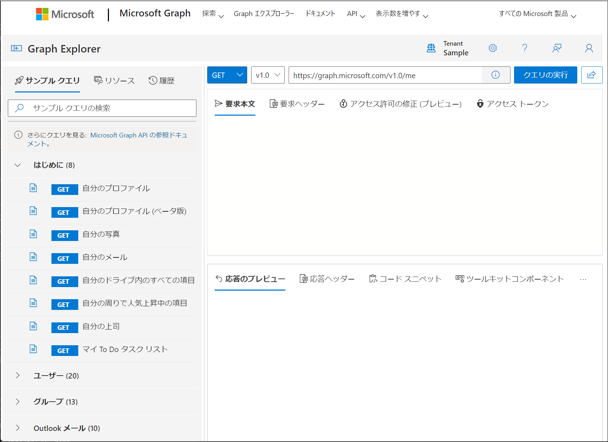
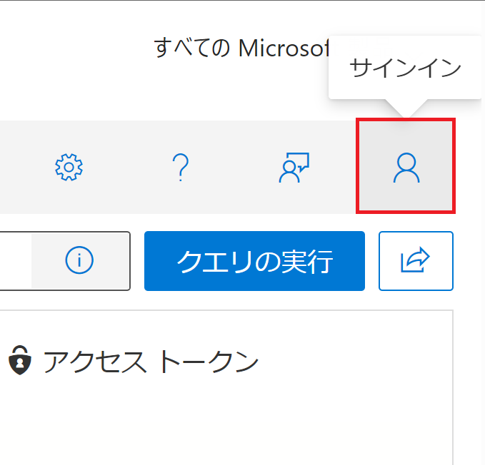
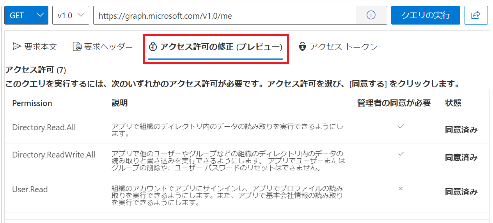
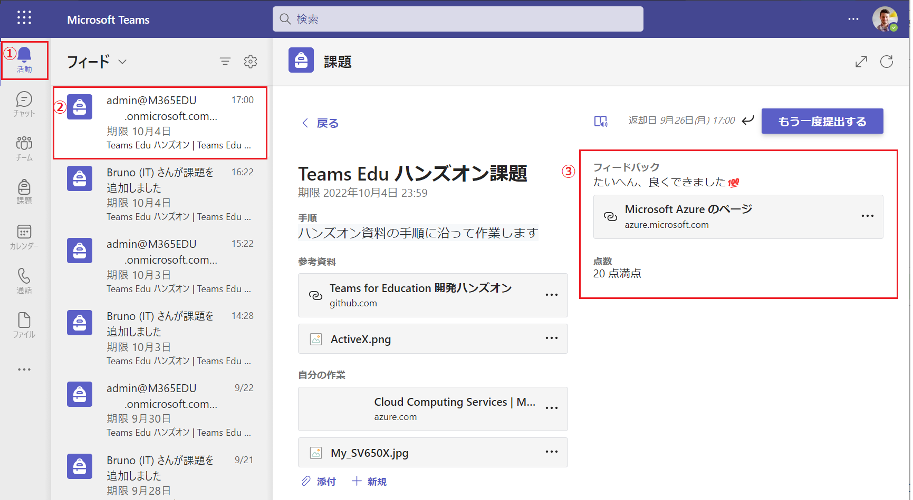

# 演習1 ) Graph API を使用した Teams Education の操作

この演習では Microsoft Graph API を使用し、実際に Microsoft Teams for Education のリソースを操作し、Graph API の概念と具体的な使い方を学習します。


## Microsoft Graph API について

Microsoft Graph API は Office 365 のような Microsoft 365 に含まれるさまざまサービスを、アプリケーションのリソースとして利用するための RESTful Web API です。

ただし、Microsoft Graph API はエンドポイントにリクエストを出せば動作するようなものではなく、それを利用するアプリケーションを [Azure Active Directory に登録](https://docs.microsoft.com/ja-jp/graph/auth-register-app-v2)し、[サービス](https://docs.microsoft.com/ja-jp/graph/auth-v2-service) または [アクセス トークン](https://docs.microsoft.com/ja-jp/graph/auth-v2-user)を取得し設定する必要があります。

演習の前段では、こうした Microsoft Graph API を呼び出す前の作業を割愛し、効率よく Microsoft Graph API の使い方を学ぶために [Graph エクスプローラー](https://developer.microsoft.com/ja-jp/graph/graph-explorer) を使用します。


## Graph エクスプローラー について

Graph エクスプローラーは、Microsoft Graph REST API リクエストを簡単に作成し、対応するレスポンスを表示できる開発者ツールです。 Microsoft Graph API を呼び出すのに必要なアプリケーションの登録やアクセストークンの取得などの処理を Graph エクスプローラーが行うので、ユーザーは目的の Microsoft Graph API のエンドポイントを記述するだけで API の機能にアクセスすることができます。



Graph エクスプローラーの使い方と詳細については以下のドキュメントをご参照ください。

* [**Graph エクスプローラーを使用して Microsoft Graph API を試す**](https://docs.microsoft.com/ja-jp/graph/graph-explorer/graph-explorer-overview)


## Microsoft Teams for Education が提供する Graph API について

Microsoft Graph API は、Microsoft 365 のさまざまなサービスの機能にアクセスすることができますが、Microsoft Teams for Education 固有の機能については[教育機関向けの API](https://docs.microsoft.com/ja-jp/graph/education-concept-overview) になります。

Microsoft Teams for Education が公開している API は API リファレンスの [教育](https://docs.microsoft.com/ja-jp/graph/api/resources/education-overview?view=graph-rest-1.0) ツリーにまとめられており、逆にこのツリー下にないものは使用することがでないと考えてほぼ間違いないでしょう。

また、ベースとなっている Microsoft Teams 自体が Microsoft 365 のさまざまなサービスを組み合わせて機能が実装されているので、該当する機能にアクセスする場合はその機能の提供元の Graph API を使用する必要があります。

たとえば、会議ノートを操作したい場合は [OnNote の API](https://docs.microsoft.com/ja-jp/graph/api/resources/onenote-api-overview?view=graph-rest-1.0)、チャネルの共有ファイルにアクセスする場合は [SharePoint](https://docs.microsoft.com/ja-jp/graph/api/resources/onedrive?view=graph-rest-1.0) の Graph API を使用する必要があります。

さらには、Microsoft Teams for Education の全ての機能が API を介して使用できるわけでもなく、そもそも機能の提供元サービスが API を公開していない場合もあるので注意が必要です。

たとえば Teams for Education の UI にメニューが用意されている Insights、Reflect はこのドキュメントの執筆時点 (2022 年 9 月) で API が公開されていませんし、**課題**を作成する際に選択できる**クイズ** は [Microsoft Forms](https://forms.office.com) が機能を提供していますが、API を利用するためのドキュメントは公開されていません。
また、Microsoft Graph API のバージョンには 1.0 と beta があり、beta には先行したさまざまな機能が実装されていますが将来的に変更される可能性があるため実稼働アプリケーションでこれらの API を使用することは推奨されません。サポートも対象外となります。

その他、Microsoft Graph の教育機関向け API については以下をご覧ください。

* [**教育機関向け API の概要**](https://docs.microsoft.com/ja-jp/graph/education-concept-overview)


## 演習 1) Teams for Education 固有のオブジェクトの列挙とドリル ダウン

この演習では Teams for Education 固有のオブジェクトであるクラスの一覧を取得し、その中から任意のひとつのクラスを選択、そのクラスに含まれる課題を列挙して、さらにその中から任意のひとつの課題を取得して、そこに含まれる結果を取得、...というようにクラスを最上位とするオブジェクトのツリーをドリル ダウンし、目的のリソースにアクセスする方法を学習します。

なお、この演習では Graph エクスプローラーを使用します。

具体的な手順は以下のとおりです。

### 手順

1. Web ブラウザーから [**Graph エクスプローラー**](https://developer.microsoft.com/graph/graph-explorer)にアクセスします　

2. Graph エクスプローラーの画面が表示されるので、画面左上の \[サインイン\] アイコンをクリックして Teams for Education の管理者アカウントでサインインします

    

3. 画面上の Graph API の呼び出しパラメーターが既定で以下のように設定されているので \[**クエリの実行**\] ボタンをクリックします

    | HTTP メソッド | バージョン | エンドポイント |
    | ---- | ---- | ---- |
    | GET | V1.0 | ```https://graph.microsoft.com/v1.0/me``` |

4. 画面下の \[**応答のプレビュー**\] タブにサインインしているユーザーの情報を含む JSON が表示されていることを確認してください

    もし、エラーが発生する場合はエンドポイントを指定するボックス直下のタブの一覧から \[**アクセス許可の修正(プレビュー)**\] タブをアクティブにし、表示されたパーミッションリストで **User.Read** の権限 \[**状態**\] フィールドが "**同意済み**" になっているか確認し、\[**同意**\] ボタンが表示されている場合は同ボタンをクリックして**同意**を行ってください

    

5. Graph エクスプローラーを使用して現在使用している Teams for Education 上に作成されている **クラスの一覧**を取得します。画面上の呼び出しパラメーターを以下のように設定して \[**クエリの実行**\] ボタンをクリックします

    [**クラスの一覧の取得**](https://learn.microsoft.com/ja-jp/graph/api/educationclass-list?view=graph-rest-1.0&tabs=http)

    | HTTP メソッド | バージョン | エンドポイント |
    | ---- | ---- | ---- |
    | GET | V1.0 | ```https://graph.microsoft.com/v1.0/education/classes``` |

6. 画面下の \[**応答のプレビュー**\] タブにクラスの一覧を含む JSON が表示されます

    列挙されたクラスの JSON の **displayName** プロパティの値を確認し、[**準備) 演習に入る前の準備**](Ex00.md) で作成したクラス "**Teams for Education 用開発ハンズオン用**" が設定されている要素を見つけ、**id** プロパティの値をコピーします。


    もし、エラーが返る場合は、API リファレンスの **educationClasses をリストする** の [**アクセス許可**](https://learn.microsoft.com/ja-jp/graph/api/educationclass-list?view=graph-rest-1.0&tabs=http#permissions) で"委任 (職場または学校のアカウント)" で必要な権限を確認し、Graph エクスプローラーの \[**アクセス許可の修正(プレビュー)**\] タブで権限 **EduRoster.ReadBasic** に同意を行ってください

7. 前の手順でコピーした ID の**クラスの情報だけ**を取得します。画面上の呼び出しパラメーターを以下のように設定して \[**クエリの実行**\] ボタンをクリックします

    [**クラス情報の取得**](https://learn.microsoft.com/ja-jp/graph/api/educationclass-get?view=graph-rest-1.0&tabs=http)

    | HTTP メソッド | バージョン | エンドポイント |
    | ---- | ---- | ---- |
    | GET | V1.0 | ```https://graph.microsoft.com/v1.0/education/classes/%コピーしたID%``` |

    画面下の \[**応答のプレビュー**\] タブに指定したクラスの JSON のみが表示されることを確認してください

8. 呼び出しパラメーターを以下のように設定し、目的のクラスに追加された**教師の一覧**と、教師を含む**メンバーの一覧**が取得できることをそれぞれ確認します

    [**教師の一覧を取得**](https://learn.microsoft.com/ja-jp/graph/api/educationclass-list-teachers?view=graph-rest-1.0&tabs=http)

    | HTTP メソッド | バージョン | エンドポイント |
    | ---- | ---- | ---- |
    | GET | V1.0 | ```https://graph.microsoft.com/v1.0/education/classes/%コピーしたID%/teachers``` |
    

    [**メンバーの一覧を取得**](https://learn.microsoft.com/ja-jp/graph/api/educationclass-list-members?view=graph-rest-1.0&tabs=http)

    | HTTP メソッド | バージョン | エンドポイント |
    | ---- | ---- | ---- |
    | GET | V1.0 | ```https://graph.microsoft.com/v1.0/education/classes/%コピーしたID%/members``` |


    もしエラーが返る場合は、Graph エクスプローラーの \[**アクセス許可の修正(プレビュー)**\] タブで必要な権限に同意を与えてください

9. [**準備) 演習に入る前の準備**](Ex00.md) で作成した課題の ID を取得するためにクラスに紐づいた**割りあて(assignments)** を列挙します

    この API の呼び出しには以下の権限が必要ですので Graph エクスプローラーの \[**アクセス許可の修正(プレビュー)**\] タブで同意を与えます

    - EduAssignments.ReadBasic
    - EduAssignments.ReadWriteBasic
    - EduAssignments.Read
    - EduAssignments.ReadWrite


    権限に同意が完了したら呼び出しパラメーターを以下のように設定し \[**クエリの実行**\] ボタンをクリックします

    **割りあて(assignments)一覧の取得**

    | HTTP メソッド | バージョン | エンドポイント |
    | ---- | ---- | ---- |
    | GET | V1.0 | ```https://graph.microsoft.com/v1.0/education/classes/%コピーしたID%/assignments``` |


    画面下の \[**応答のプレビュー**\] タブに 割りあて の一覧を含む JSON が表示されるので、**displayName** プロパティが "**Teams Edu ハンズオン課題**" となっているものを見つけ **id** プロパティの値をメモします

10. 前の手順で取得した 割り当て の **id** を使用して**課題の情報**を取得します。

    呼び出しパラメーターを以下のように設定し \[**クエリの実行**\] ボタンをクリックします

    [**割りあて(assignments)情報の取得**](https://learn.microsoft.com/ja-jp/graph/api/educationassignment-get?view=graph-rest-1.0&tabs=http)

    | HTTP メソッド | バージョン | エンドポイント |
    | ---- | ---- | ---- |
    | GET | V1.0 | ```https://graph.microsoft.com/v1.0/education/classes/%クラスのID%/assignments/%コピーしたID%``` |

    \[**応答のプレビュー**\] タブに表示される JSON の以下のプロパティを確認し、[**準備) 演習に入る前の準備**](Ex00.md) で作成した **課題** であることを確認してください。

    - displayName
    - dueDateTime
    - assignedDateTime
    - createdDateTime
    - lastModifiedDateTime
    - status
    - instructions.content
    - grading.maxPoints
    - createdBy.user.id (※)
    - lastModifiedBy.user.id (※)
    
    ※この GUID はユーザーの Object ID であり、以下のエンドポイントの Graph API を呼び出してユーザーの情報を取得することができます。

    | HTTP メソッド | バージョン | エンドポイント |
    | ---- | ---- | ---- |
    | GET | V1.0 | ```https://graph.microsoft.com/v1.0/users/%取得したGUID%``` |

11. 課題 に**添付されている URL やファイル**を取得します

    呼び出しパラメーターを以下のように設定し \[**クエリの実行**\] ボタンをクリックします

    [**割りあて(assignments) リソース一覧の取得**](https://learn.microsoft.com/ja-jp/graph/api/educationassignment-list-resources?view=graph-rest-1.0&tabs=http)

    | HTTP メソッド | バージョン | エンドポイント |
    | ---- | ---- | ---- |
    | GET | V1.0 | ```https://graph.microsoft.com/v1.0/education/classes/%クラスのID%/assignments/%コピーしたID%/resources``` |

    \[**応答のプレビュー**\] タブに JSON が表示されるので、 **displayName** の値が "**Teams for Education 開発ハンズオン**" となっているエントリーを見つけます。

    同エントリーの **link** プロパティにこのハンズオンの URL が設定されていることを確認します 

    次に、**displayName** プロパティの値が課題を作成する際に添付した画像ファイルのファイル名になっているエントリーを見つけ、**fileUrl** プロパティに設定されている URL をコピーします。この URL は Graph API の有効なエントリーポイントで、これを使用してアタッチされたファイルの情報を取得することができます。

12. 前の手順でコピーした **fileUrl** プロパティの URL を使用して課題にアタッチされたファイルの情報を取得します。

     呼び出しパラメーターを以下のように設定し \[**クエリの実行**\] ボタンをクリックします

    [**ファイル情報の取得**](https://learn.microsoft.com/ja-jp/graph/api/driveitem-get?view=graph-rest-1.0&tabs=http)

    | HTTP メソッド | バージョン | エンドポイント |
    | ---- | ---- | ---- |
    | GET | V1.0 | %前の手順で取得した**fileUrl** プロパティの値(URL)% |

    \[**応答のプレビュー**\] タブに表示される JSON の以下のプロパティでそれぞれファイルにアクセスすることができます。

    | プロパティ | 動作 |
    | ---- | ---- |
    | @microsoft.graph.downloadUrl | ファイルをダウンロード (有効時間は 1 時間) |
    | webUrl | Web ブラウザーからアクセス |

13. 割り当てたユーザー(学生)より**提出された課題 = 申請 (Submission) の一覧**を取得します。

    呼び出しパラメーターを以下のように設定し \[**クエリの実行**\] ボタンをクリックします

    **申請 (Submission) の一覧を取得**

    | HTTP メソッド | バージョン | エンドポイント |
    | ---- | ---- | ---- |
    | GET | V1.0 | ```https://graph.microsoft.com/v1.0/education/classes/%クラスのID%/assignments/%割り当てのID%/submissions``` |

    
    \[**応答のプレビュー**\] タブ表示された JSON から任意の**申請** の **id** プロパティの値をコピーします

14. 学生が課題を提出する際に**添付したリソースの一覧**を取得します

    呼び出しパラメーターを以下のように設定し \[**クエリの実行**\] ボタンをクリックします

    **申請 (Submission) に添付されたリソースの一覧を取得**

    | HTTP メソッド | バージョン | エンドポイント |
    | ---- | ---- | ---- |
    | GET | V1.0 | ```https://graph.microsoft.com/v1.0/education/classes/%クラスのID%/assignments/%割り当てのID%/submissions/コピーしたID/resources``` |


    \[**応答のプレビュー**\] タブに JSON が返されます。

    手順 11 の内容と同じく、添付されているものが URL であれば　**link** プロパティから、ファイルであれば **fileUrl** プロパティのエンドポイントを介してそれぞれリソースにアクセスすることができます

15. 学生から提出された課題に対する、**フィードバックを作成**します

    この処理を行うには対象の **申請 (Submission)** から **結果 (Outcome)** の一覧を取得し、**@odata.type** プロパティの値が "**#microsoft.graph.educationFeedbackOutcome**" である **id** の **結果 (Outcome)** の内容を更新したのちに Return 処理を行います

    最初に呼び出しパラメーターを以下のように設定し**結果 (Outcome)** の一覧を取得します。

    [**結果 (Outcome)一覧を取得**](https://learn.microsoft.com/ja-jp/graph/api/educationsubmission-list-outcomes?view=graph-rest-1.0&tabs=http)

    | HTTP メソッド | バージョン | エンドポイント |
    | ---- | ---- | ---- |
    | GET | V1.0 | ```https://graph.microsoft.com/v1.0/education/classes/%クラスのID%/assignments/%割り当てのID%/submissions/申請ID/outcomes```
    
    返された JSON で **@odata.type** プロパティの値が "**#microsoft.graph.educationFeedbackOutcome**" である **id** をコピーし、呼び出しパラメーターを以下のように設定して**結果 (Outcome)** の内容を更新します。

    | HTTP メソッド | バージョン | エンドポイント |
    | ---- | ---- | ---- |
    | PATCH | V1.0 | ```https://graph.microsoft.com/v1.0/education/classes/%クラスのID%/assignments/%割り当てのID%/submissions/申請ID/outcomes/コピーしたID```

    ```
    {
        "@odata.type": "#microsoft.graph.educationFeedbackOutcome",
        "feedback": {
            "text": {
                "content": "たいへん、良くできました💯",
                "contentType": "text"
            }
        }
    }
    ```
    HTTP メソッドが GET や POST でなく、**PATCH** であることにご注意ください。


    【メモ】

    現在、Bata バージョンの機能ではありますが、このタイミングで学生へのフィードバックに URL や 1 部のファイルを添付することができまます。

    以下は URL を添付する際の呼び出しパラメーターの例です。

     | HTTP メソッド | バージョン | エンドポイント |
    | ---- | ---- | ---- |
    | PATCH | beta | ```https://graph.microsoft.com/beta/education/classes/%クラスのID%/assignments/%割り当てのID%/submissions/申請ID/```

    ※エンドポイントの最後が **outcome でないこと**、HTTP メソッドが GET や POST でなく、**PATCH** であることにご注意ください。
    ```
    {
        "@odata.type": "#microsoft.graph.educationFeedbackResourceOutcome",
        "feedbackResource": {
            "@odata.type": "#microsoft.graph.educationLinkResource",
            "displayName": "Microsoft Azure のページ",
            "link": "https://azure.microsoft.com/"
        }
    }
    ```
    
    その他のリソースの添付方法については以下のドキュメントをご参照ください。

    * [**educationFeedbackResourceOutcome を作成する**](https://learn.microsoft.com/ja-jp/graph/api/educationfeedbackresourceoutcome-post-outcomes?view=graph-rest-beta)

16. 提出された申請の状態を "送信済み" から "返された" に変更し、学生がフィードバックを利用できるようにします

    呼び出しパラメーターを以下のように設定し \[**クエリの実行**\] ボタンをクリックします

    [**申請 (Submission) を戻す**](https://learn.microsoft.com/ja-jp/graph/api/educationsubmission-return?view=graph-rest-1.0&tabs=http)

    | HTTP メソッド | バージョン | エンドポイント |
    | ---- | ---- | ---- |
    | POST | V1.0 | ```https://graph.microsoft.com/beta/education/classes/%クラスのID%/assignments/%割り当てのID%/submissions/申請ID/return```|

17. **学生**のアカウントで Teams クライアントにサインインし、画面左のメニューバーから \[**活動**\] をクリックすると、課題のフィードバックが返されたことが通知されているので、通知アイテムをクリックしてフィードバックの内容を表示します

    

    **フィードバック**に Graph Explorer で指定した文言と、リンクが添付されていることを確認します。


    ```
    {
    "displayName": "Graph API で作成した課題",
    "dueDateTime": "2022-09-30T14:59:00Z",
    "instructions": {
        "content": "ハンズオン資料の手順に沿って作業します",
        "contentType": "html"
    },
    "grading": {
        "@odata.type": "#microsoft.graph.educationAssignmentPointsGradeType",
        "maxPoints": 50
    },
    "assignTo": {
        "@odata.type": "#microsoft.graph.educationAssignmentClassRecipient"
    },
    "status": "draft",
    "allowStudentsToAddResourcesToSubmission": "true"
}
    ```


    


    


