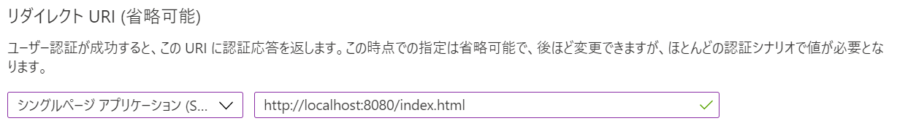
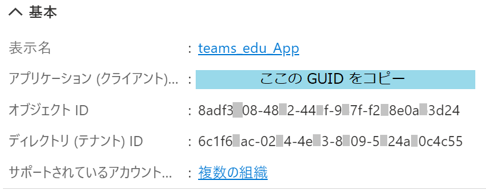
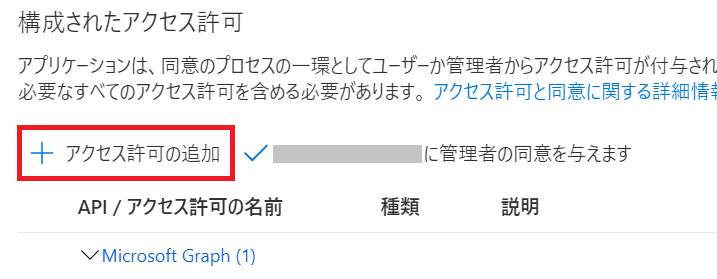
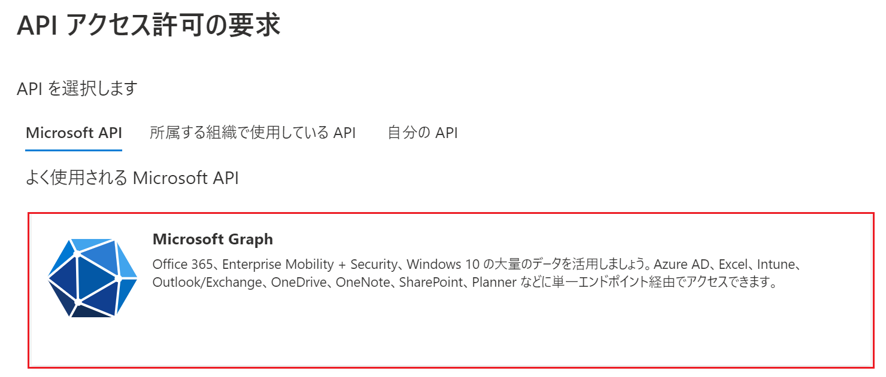
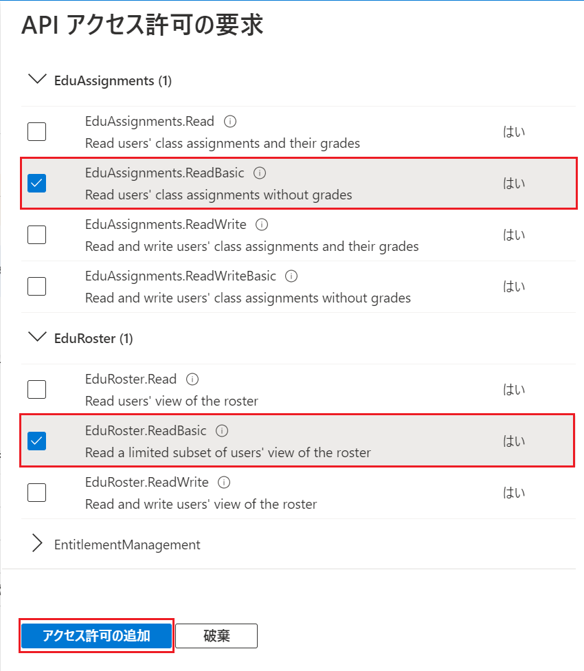
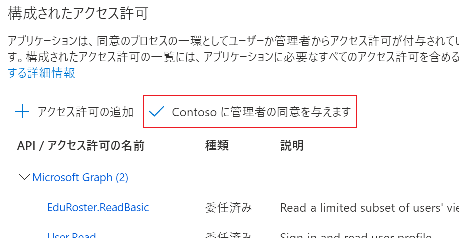

# 演習 2 ) Teams for Education を操作する SPA の作成

この演習では Graph API を使用したアプリケーション開発をシンプルに説明するために、アプリケーションのロジックが Web ブラウザーの中で完結する SPA (Single Page Application) を開発します。

アプリケーションから Graph API を使用するには、アクセストークンを取得するコードの記述だけでなく、アプリケーションからの認証のリクエストを受けて処理をする Azure Active Directory の設定も必要です。

この演習 2 では作成するアプリケーションの Azure Active Directory への登録からプログラムコードによるアクセストークンの取得、取得したアクセストークンを使用した Graph API の取得をシンプルな SPA の開発を通して体験します。

<br><br>

## 演習 2-1 : Azure Active Directory へのアプリケーションの登録

アプリケーションのからの認証要求を受け付けるための Azure Active Directory の設定を行います。

Microsoft Graph API を使用するためにはこれを使用するアプリケーションを Azure Active Airectory に登録し、管理できるようにする必要があります。

これによりアプリケーションからの認証の要求の処理や、アクセス権の決定、トークンの発行などが行えるようになります。

Azure Active Airectory は Azure や Office 365 や Dynamics 365 といった Microsoft の SaaS サービスのアカウント管理だけなく、開発者が新たに開発するアイデンティティ管理のプラットフォームとして利用することができます。

このようにアプリケーションから利用可能な Azure Active Airectory のアイデンティティ管理基盤を[Microsoft ID プラットフォーム](https://learn.microsoft.com/ja-jp/azure/active-directory/develop/v2-overview)と呼びます。

### このアプリケーションの認証フロー
この演習で作成するアプリケーションの認証フローは OAuth 2.0 認証コード フローを使用します。


ここから、アプリケーションから Azure Active Airectory の認証機能を利用するための登録方法の手順を紹介します。

なお、この設定はアプリケーションの作成前でも作成後でも行えますが、アプリケーションのコード内に Azure Active Airectory 登録時に生成される ID 等を記述する必要があるのであらかじめ行っておいたほうが手戻りは少なくなります。

<br><br>

## Azure Active Airectory へのアプリケーションの登録

Azure Active Airectory にアプリケーションの登録を行い、トークンを受け取るためのリダイレクト URL や使用する Graph API が必要とするスコープ(権限)などを設定し、認証に必要なクライアント ID を入手します。

具体的な手順は以下のとおりです。

### 手順

1. [Azure ポータル](https://portal.azure.com)にログインします

2. 左上にあるハンバーガーメニューをクリックしてメニュー ブレードを表示し \[**Azure Active Directory**\] を選択します

    

3. Azure AD のブレードより [\[**アプリの登録**\]](https://portal.azure.com/#view/Microsoft_AAD_IAM/ActiveDirectoryMenuBlade/~/RegisteredApps) をクリックします

4. アプリの登録画面が表示されるので画面上部の \[**+ 新規登録**\] メニューをクリックします

    

5. アプリケーションの登録画面が表示されるので \[**名前**\] にアプリケーション名を入力します

    この演習では "**teams_edu_App**" という名前を使用します。なお、この名前は後で変更することができます

6. \[**サポートされているアカウントの種類**\] で、 \[**任意の組織ディレクトリ内のアカウント (任意の Azure AD ディレクトリ - マルチテナント) と個人の Microsoft アカウント (Skype、Xbox など)**\]を選択します

7. \[**リダイレクト URI (省略可能)**\] のドロップダウンリストから \[**シングルページ アプリケーション**\] を選択し、右側のテキストボックスに以下の URL を記述します

    ```http://localhost:8080/index.html```

    ここに指定する URL は https で始まる必要がありますが localhost アドレスは例外的に http が使用できます。

    

8. \[**登録**\] ボタンをクリックします。

    なお、この設定は後から左側のメニューの \[**管理**\] セクションにある \[**認証**\]から追加や変更をすることができます

9. 画面左のメニューの \[**概要**\] をクリックし、表示された画面で \[**アプリケーション (クライアント)***\] の内容をコピーし、テキストファイルなどにメモします

    

    ここまでの作業で、Azure Active Directory への基本的なアプリケーションの登録は完了です。

    次の手順からはクラスの一覧の取得などの処理に必要なスコープ(アクセス権)を設定します。

10. 画面左のブレードから \[API の**アクセス許可**\] をクリックします

11. 画面右のペインで \[**+ アクセス許可の追加**\] をクリックします

    

12. 画面右に \[API アクセス許可の要求\]ブレードが表示されるので、\[Microsoft API\] タブの中の \[**Microsoft Graph**\]タイルをクリックします

    このタイルは画面を下にスクロールしないと表示されない場合があります。

    

13. "アプリケーションに必要なアクセス許可の種類"の画面になるので \[**委任されたアクセス許可**\] タイルをクリックします

14. 表示されたアクセス許可のリストから \[**EduAssignments**\]  をクリックして \[**EduAssignments.ReadBasic**\] にチェックし、同様に \[**EduRoster**\] をクリックして \[**EduRoster.ReadBasic**\] にチェックし、画面下の\[**アクセス許可の追加**\] ボタンをクリックします

    

    \[API アクセス許可の要求\]ブレードが閉じ、追加したアクセス許可の名前がリストに表示されていますが、まだ有効になっていません。**有効にするためにはテナント管理者の同意が必要**です。

15. 前の手順で追加したアクセス要求を有効にするために [+ アクセス許可の追加] の右隣にある [**(現在のAADテナント名)に管理者の同意を与えます**]をクリックします

    

    [**(現在のAADテナント名)に管理者の同意を与えます**]が淡色表示の場合は、テナントの管理者に連絡して同意を付与してもらうか、Azure Active Airectory のテナントが作成できる場合は、自分で作成した Azure Active Airectory テナントで作業してください。

16. \[**管理者の同意を与えます**\] メッセージボックスが表示されるので、\[**はい**\]ボタンをクリックします

    「**同意の付与に成功しました**」と通知メッセージが返るのを確認します

以上で Azure Active Airectory へのアプリケーションま登録とアクセス許可の追加は完了です。

これにより、アプリケーションのコードから EduRoster.ReadBasic のアクセス許可を要求することができます。

次のタスクでは SPA(Single Page Application) を新規に作成し、[MSAL](https://learn.microsoft.com/ja-jp/azure/active-directory/develop/msal-overview) を使用したログイン処理を実装します。

<br><br>
_ _ _
👉 [**演習 2 - 2) SPA の新規作成とMSAL.js を使用したログイン処理の実装**](Ex02-2.md)

[**戻る**](Ex01-2.md) 👈

