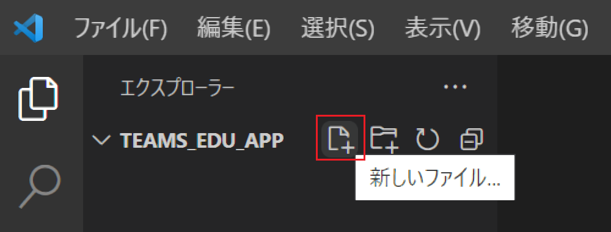
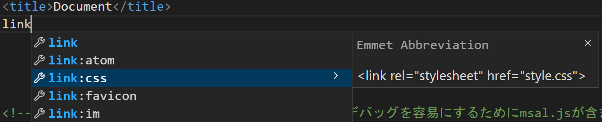
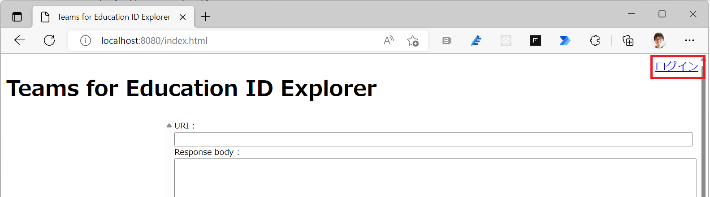
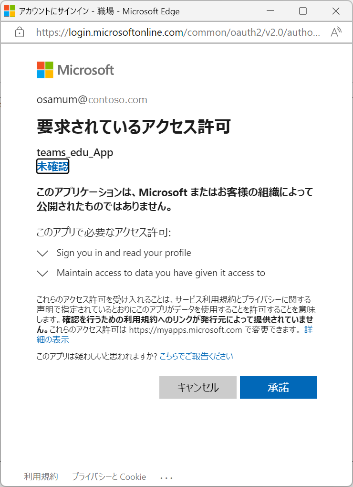
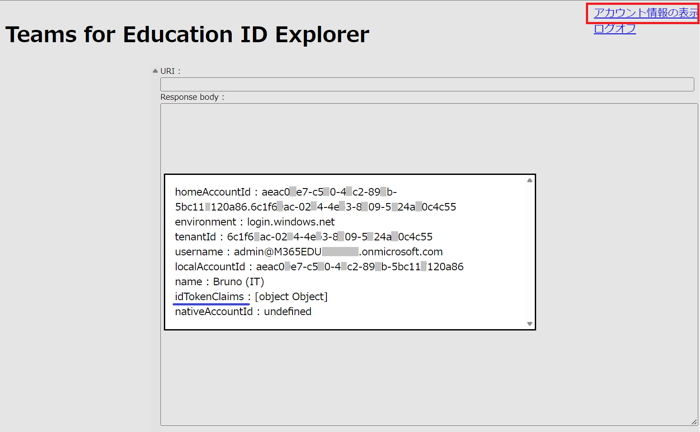

# 演習 2 - 2) SPA の新規作成とMSAL.js を使用したログイン処理の実装

この演習では Web ブラウザー内で完結して動作する Single Page Application (SPA) を新規で作成します。

同アプリケーションに Microsoft Authentication Library (MSAL) の JavaScript 用のライブラリである [MSAL.js](https://learn.microsoft.com/ja-jp/azure/active-directory/develop/single-page-app-quickstart?pivots=devlang-javascript#msaljs) を使用して Azure Active Directory にサインインし、Graph API にアクセスする際に必要となるアクセストークンを取得する機能を実装します。

アプリケーションの処理としては以下のようになります。

1. MSAL を使用した Azure Active Airectory へのログイン
2. Azure Active Airectory から返される ID トークンの取得
3. Graph API にアクセスするためのアクセストークンの取得

なお、今回は JavaScript で記述しますが、MSAL は、.NET、JavaScript、Java、Python、Android、iOS などの、さまざまなアプリケーション アーキテクチャとプラットフォームをサポートします。

詳細については以下のドキュメントを参照してください。

* [**Microsoft Authentication Library (MSAL) の概要 - 言語とフレームワーク**](https://learn.microsoft.com/ja-jp/azure/active-directory/develop/msal-overview#languages-and-frameworks)

この演習で作成するアプリケーションは認証処理に OAuth 2.0 認証コード フローを使用するので、MSAL.js (Microsoft Authentication Library for JavaScript) 2.0 を使用します。

<br><br>

## 演習用アプリケーションの作成と認証機能の実装
ローカルで実行可能な演習用の SPA を作成し Azure Active Airectory を使用した認証機能を実装します。

このアプリケーションでは Azure Active Airectory での認証後、ログインしたユーザーの表示名とアカウント名を表示します。

作成手順は以下のとおりです。

### 手順

1. ローカルディスク上に **teams_edu_App** という名前でフォルダを作成します

    この演習では解り易いようにフォルダ名を Azure Active Airectory に登録したアプリケーション名と同じにしましたが、とくに同じにしなければならないということはありません

2. 作成したフォルダを右クリックし、表示されたコンテキストメニューから \[**Codeで開く**\]を選択し、Visual Studio Code で開きます

    コンテキストメニューから \[Codeで開く\]が表示されない場合は、別途 Visual Studio Code を起動し、メニュー\[File\]-\[Open Folder\] を選択してフォルダをオープンしてください

3. 画面左のツリービュー内にあるフォルダ名 \[**teams_edu_App**\] の右隣にある \[**新しいファイル**\]アイコンをクリックし、表示されたテキストボックスに **index.html** と入力してファイル index.html を作成します

    


4. 作成した index.html が編集状態になっていることを確認し、エディタ画面内で **!** と入力し、すぐにキーボードの \[Tab\] キーを押下して基本的な HTML タグを挿入します

5. 挿入されたタグ HTML タグの lang 属性を **ja** に、title タグの内容を document から **Teams for Education ID Explorer** に変更します

6. 画面に適用するスタイルシートを作成して参照させます。
    
    title タグの下の行で **link** とタイプして表示される候補の中から **link:css** を選択します

    

7. script タグが挿入され **href** 属性の " (ダブルクォーテーション) 内にカーソルが移動するので **index.css** と記述します

8. 記述したファイル名 **index.css** を\[Crtl\] キーを押下しながらクリックすると"**'index.css を開くことができません'**" と書かれたメッセージボックスが表示されるので \[**ファイルの作成**\] ボタンをクリックします

9. **index.css** ファイルが作成され編集状態になるのでエディタ画面に以下のコードを貼り付けます

    ```
    #ground{
        width: auto;
        height: 100vh;
    }

    #loginedArea {
        display: none;
        width: auto;
        position: fixed;
        right: 0;
    }

    #beforeLogineArea {
        display: block;
        width: auto;
        position: fixed;
        right: 0;
    }

    #manipulateArea{
        height:calc(100% - 180px); 
        width:auto;
        display:flex;
    }

    #treeView {
        width: 300px;
        height: 100%;
        overflow-y: scroll;
    }

    #restAPI_area{
        width:900px;
        height: 100%;
        font-size: 12px;
    }

    #responseView {
        width: 100%;
        height: calc(100% - 100px);
    }

    #reqEndpoint{
        width: 800px;
    }

    ul {background-color: white;}
    li {cursor: pointer;}
    .selectedItem{background-color: #DCDFFA;}

    dialog {
        font-size: 15px;
        width: 50%;
        overflow-y: scroll;
    }
    ```
    キーボードの\[**Ctrl**\] + \[**S**\]キーを押下して index.css の内容を保存します


10. **index.html** の編集画面に戻り、前の手順で記述した **link タグの下の行に**、msal.js を参照するための以下のタグをコピーして貼り付けます

    ```
    <!-- msal.min.jsはmsal.jsの代わりに使用できます。デバッグを容易にするためにmsal.jsが含まれています -->
    <script src="https://alcdn.msauth.net/browser/2.30.0/js/msal-browser.js"
        integrity="sha384-o4ufwq3oKqc7IoCcR08YtZXmgOljhTggRwxP2CLbSqeXGtitAxwYaUln/05nJjit"
        crossorigin="anonymous"></script>

    <!-- 信頼性を確保するために、マイクロソフトは 2 つ目の CDN を提供しています -->
    <script type="text/javascript">
        if (typeof Msal === 'undefined') document.write(unescape("%3Cscript src='https://alcdn.msftauth.net/browser/2.30.0/js/msal-browser.js' type='text/javascript' crossorigin='anonymous' %3E%3C/script%3E"));
    </script>
    ```

    キーボードの\[**Alt**\] + \[**Shift**\] + \[**F**\] キーを押下し、コードのインデントを整形します

11. 前の手順で記述した script タグの閉じタグの下で **script** とタイプして表示される候補から **script:src** を選択します

    

12. script タグが挿入され src 属性の " (ダブルクォーテーション) 内にカーソルが移動するので **aadAuth.js** と記述します

13. 記述したファイル名 aadAuth.js を\[Crtl\] キーを押下しながらクリックすると"**'aadAuth.js を開くことができません'**" と書かれたメッセージボックスが表示されるので \[**ファイルの作成**\] ボタンをクリックします

14. aadAuth.js ファイルが作成され編集状態になるのでエディタ画面に以下のコードを貼り付けます

    ```
    /**
    * 作成時に MSAL インスタンスに渡される構成オブジェクト 
    * MSAL.js設定パラメータの完全なリストについては:
    * https://github.com/AzureAD/microsoft-authentication-library-for-js/blob/dev/lib/msal-browser/docs/configuration.md 
    */
    const msalConfig = {
        auth: {
            clientId: "%AADクライアントIDを記述%",
            authority: "https://login.microsoftonline.com/common",
            redirectUri: "http://localhost:8080/index.html",
        },
        cache: {
            cacheLocation: "sessionStorage", // キャッシュを保存する場所を構成
            storeAuthStateInCookie: false, // IE11 または Edge で問題が発生する場合は、この値を "true" に設定
        },
        system: {	
            loggerOptions: {	
                loggerCallback: (level, message, containsPii) => {	
                    if (containsPii) {		
                        return;		
                    }		
                    switch (level) {		
                        case msal.LogLevel.Error:		
                            console.error(message);		
                            return;		
                        case msal.LogLevel.Info:		
                            console.info(message);		
                            return;		
                        case msal.LogLevel.Verbose:		
                            console.debug(message);		
                            return;		
                        case msal.LogLevel.Warning:		
                            console.warn(message);		
                            return;		
                    }	
                }	
            }	
        }
    };

    // メインの myMSALObj インスタンスを生成
    const myMSALObj = new msal.PublicClientApplication(msalConfig);
    let username = "";

    /**
    * ここに追加したスコープは、サインイン時にユーザーの同意を求めます.
    * 既定では MSAL.js は OIDC スコープ (openid, profile, email) をすべてのログインリクエストに追加します.
    * OIDC スコープの詳細については、: 
    * https://docs.microsoft.com/en-us/azure/active-directory/develop/v2-permissions-and-consent#openid-connect-scopes
    */
    const loginRequest = {
        scopes: ["User.Read"]
    };

    /**
    * MS Graph API のアクセス トークンを取得するときに要求するスコープをここに追加します。詳細については:
    * https://github.com/AzureAD/microsoft-authentication-library-for-js/blob/dev/lib/msal-browser/docs/resources-and-scopes.md
    */
    const tokenRequest = {
        scopes: ['User.Read','Directory.Read.All'],
        forceRefresh: false // キャッシュされたトークンをスキップし、サーバーに移動して新しいトークンを取得するには、これを "true" に設定します
    };

    function selectAccount() {
    /**
    * アカウント検索の詳細はこちらをご覧ください。: 
    * https://github.com/AzureAD/microsoft-authentication-library-for-js/blob/dev/lib/msal-common/docs/Accounts.md
    */

        const currentAccounts = myMSALObj.getAllAccounts();
        if (currentAccounts.length === 0) {
            return;
        } else if (currentAccounts.length > 1) {
            // Add choose account code here
            console.warn("Multiple accounts detected.");
        } else if (currentAccounts.length === 1) {
            username = currentAccounts[0].username;
        }
    }

    function handleResponse(response) {
    /**
    * レスポンスオブジェクトのプロパティの完全なリストは:
    * https://github.com/AzureAD/microsoft-authentication-library-for-js/blob/dev/lib/msal-browser/docs/request-response-object.md#response
    */
        if (response !== null) {
            let accoutInfo = response.account;
            username = accoutInfo.username;
            //ログイン済ユーザー情報を表示
            showPropertyName_and_Value(accoutInfo);
            //画面の表示を切り替える
            flip_flopDisplay(beforeLogineArea, loginedArea);

            /* このコメントを演習 2-3 手順 3 のコードと置き換えます */  

        } else {
            selectAccount();
        }
    }

    function logon() {
    /**
    * 以下にカスタムリクエストオブジェクトを渡すことができます。これにより、初期設定が上書きされます。詳細はこちらをご覧ください。:
    * https://github.com/AzureAD/microsoft-authentication-library-for-js/blob/dev/lib/msal-browser/docs/request-response-object.md#request
    */
        myMSALObj.loginPopup(loginRequest)
        .then(handleResponse)
        .catch(error => {
            console.error(error);
        });
    }

    function logoff() {
    /**
    * 以下にカスタムリクエストオブジェクトを渡すことができます。これは初期設定を上書きします。詳細については、以下を参照してください:
    * https://github.com/AzureAD/microsoft-authentication-library-for-js/blob/dev/lib/msal-browser/docs/request-response-object.md#request
    */

        //ログアウトするアカウントを選択します。
        const logoutRequest = {
            account: myMSALObj.getAccountByUsername(username)
        };
        myMSALObj.logout(logoutRequest);
    }

    ```

    キーボードの\[**Alt**\] + \[**Shift**\] + \[**F**\] キーを押下し、コードのインデントを整形します

15. 貼り付けたコード中の **%AADクライアントIDを記述%** と書かれたところを Azure Active Airectory にアプリケーションの登録を行った際にメモしたクライアント ID で書き変え、キーボートの\[**Crlt**\] + \[**S**\]を押下して aadAuth.js への変更を保存します

16. エディタを **index.html** に切り替え、body タグ内に以下のタグを貼り付けます
    ```
    <div id="ground">
        <dialog id="display"></dialog>
        <div style="display:flex;">
            <div>
                <h1>Teams for Education ID Explorer</h1>
            </div>
            <div id="loginedArea" style="display: none;">
                <a href="javascript:showProfileDialog()">アカウント情報の表示</a>
                <br>
                <a id="logOffButton" href="javascript:logoff()">ログオフ</a>
            </div>
            <div id="beforeLogineArea" style="display: block; ">
                <a id="logOnButton" href="javascript:logon()">ログイン</a>
            </div>
        </div>
        <div id="manipulateArea">
            <div id="treeView"></div>
            <div id="restAPI_area">
                <div>
                    <label for="reqEndpoint">URI : </label><input type="text" id="reqEndpoint" ></span>
                </div>
                <div >Response body :</div>
                <textarea title="Response body" id="responseView"></textarea>
            </div>
        </div>
    </div>
    ```

17. index.html に追加した HTML タグ(UI)を操作するための簡単なコードを追加します。

    **body の閉じタグ**下の行で、 **script** とタイプして表示される候補から **script:src** を選択します

18. script タグが挿入され src 属性の " (ダブルクォーテーション) 内にカーソルが移動するので **index.js** と記述します

19. 記述した**ファイル名 index.js を\[Crtl\] キーを押下しながらクリック**すると"**'index.js を開くことができません'**" と書かれたメッセージボックスが表示されるので \[**ファイルの作成**\] ボタンをクリックします

20. **index.js** ファイルが作成され編集状態になるのでエディタ画面に以下のコードを貼り付けます

    ```
    const $id = (id) => { return document.getElementById(id) };

    //コントロールのインスタンスをセット
    const loginedArea = $id('loginedArea'),
        beforeLogineArea = $id('beforeLogineArea'),
        treeView = $id('treeView'),
        reqEndpoint = $id('reqEndpoint'),
        responseView = $id('responseView'),
        display = $id('display');

    //ログオン/ログオフボタンのイベントハンドラをセット
    $id('logOnButton').addEventListener('click', logon);
    $id('logOffButton').addEventListener('click', logoff);

    //情報表示用のエレメントを追加
    function showItem(text) {
        let elm = document.createElement('div');
        elm.innerText = text;
        display.appendChild(elm);
    }

    //表示、非表示が相反するコントロールの表示を切り替える
    function flip_flopDisplay(ctrl1, ctrl2) {
        ctrl1.style.display = ctrl2.style.display;
        ctrl2.style.display = (ctrl2.style.display === 'none') ? 'block' : 'none';
    }

    //プロパティ名と値を表示
    function showPropertyName_and_Value(objInfo) {
        for (var prop in objInfo) {
            showItem(`${prop} : ${objInfo[prop]}`);
        }
    }

    //アカウント情報のダイアログボックスを表示
    function showProfileDialog() {
        display.showModal();
    }
    //アカウント情報のダイアログボックスを閉じる
    display.addEventListener('click', (e) => {
        e.target.close();
    });
    ```

    キーボードの\[Ctrl\] + \[S\] キーを押下して index.js への変更を保存します

21. いったん **index.html** の編集画面に切り替え、キーボードの\[Ctrl\] + \[S\] キーを押下して追加された参照の情報を保存し、次に Visua Studio Code のメニュー\[**ターミナル**\]-\[**新しいターミナル**\]をクリックし、表示されたターミナル画面に以下のコマンドを記述してキーボードの\[Enter\] キーを押下して http-server (ローカルWebサーバー)のサービスを開始します
    ```
    http-server
    ```

    > **注**: Windows 環境で、もし http-server コマンド実行時に "http-server : このシステムではスクリプトの実行が無効になっているため、ファイル (略)\Roaming\npm\http-server.ps1 を読み込むことができません。"というエラーメッセージが返る場合は、以下の[コマンド](https://go.microsoft.com/fwlink/?LinkID=135170)を実行後、再度お試しください。
    ```
    Set-ExecutionPolicy -ExecutionPolicy RemoteSigned -Scope LocalMachine
    Set-ExecutionPolicy -ExecutionPolicy RemoteSigned -Scope CurrentUser　
    ```

22. Web ブラウザーを起動し、Azure Active Airectory にアプリケーションとして登録した URL である[http://localhost:8080/index.html](http://localhost:8080/index.html) にアクセスします

    \(※ http://127.0.0.1:8080/index.html でも、同じページが表示されますが Azure Active Directory へ URL が登録されていないため認証は行われませんのでこの演習では**必ず localhost を**使用してください\)

13. 表示されたページの右上にあると **\[ログオン\]** リンクをクリックするとサインインイン用のポップアップウィンドウが表示されるので アプリケーションを登録した Azure Active Directory のアカウントを選択してログインします

    

    なお、ログイン初回「要求されているアクセス許可」ボックスが表示されるので、\[組織の代理としてログインする\]チェックボックスにチェックをつけ \[承諾\]ボタンをクリックしてください

    

23. ログオンが成功すると画面右上に **アカウント情報の表示** リンクが表示されクリックすると、モーダルダイアログ ボックスに認証時に返されたアカウント情報が表示されます。

    

    モーダルダイアログ ボックスは画面のどこかをクリックすると消えます。

    > **注:** もし、コードを修正してもページの内容が更新されない場合は、Web ブラウザーの画面でキーボードの\[**F12**\]キーを押下して開発者ツールを起動し、ページのキャッシュを無効にしてからページを更新してください。キャッシュの無効化は開発者ツールの\[ネットワーク\]メニューで行います。
    

ここまでの手順で、MSAL.js を使用して Azure Active Directory によってアカウント情報を認証するコードを実装することができました。もしうまくいかない場合は [**サンプル**](samples/Ex02-2) の内容を参考にしてください。

ただし、認証処理で入手したのは、アクセストークンを入手するための ID トークンであり、これを使用して Azure Active Directory 認証で保護された API にアクセスすることはできません。

次のタスクはでアクセストークンを取得するコードを実装します。


<br><br>
_ _ _
👉 [**演習 2 - 3) MSAL.js を使用したアクセス トークンの取得**](Ex02-3.md)

[**戻る**](Ex02-1.md) 👈