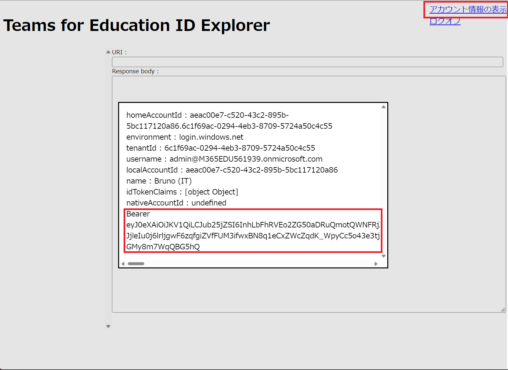

# 演習 2 - 3) MSAL.js を使用したアクセス トークンの取得

Graph API にアクセスするためのアクセストークンを取得するコードを記述します。

アクセストークンは Graph API を呼び出す際のリクエスト内の Authorization ヘッダーに値として Bearer(半角スペース)%アクセストークン% のように設定します。

この演習ではアクセストークンの取得までを行います。

手順は以下のとおりです。

### 手順

1. 演習 2 -2 で作成した演習用アプリケーションのフォルダを Visual Studio Code で開きます

2. **aadAuth.js** をオープンし、**ファイルの一番最後に**以下の関数を追加します

    ```
    function getTokenPopup(request) {
    /**
    * アカウント検索の詳細はこちらをご覧ください: 
    * https://github.com/AzureAD/microsoft-authentication-library-for-js/blob/dev/lib/msal-common/docs/Accounts.md
    */
        request.account = myMSALObj.getAccountByUsername(username);
        return myMSALObj.acquireTokenSilent(request)
            .catch(error => {
                console.log("サイレントトークンの取得に失敗しました。 ポップアップを使ったトークンの取得");
                if (error instanceof msal.InteractionRequiredAuthError) {
                    // fallback to interaction when silent call fails
                    return myMSALObj.acquireTokenPopup(request)
                        .then(tokenResponse => {
                            console.log(tokenResponse);
                            return tokenResponse;
                        }).catch(error => {
                            console.error(error);
                        });
                } else {
                    console.log(error);   
                }
        });
    }
    ```
3. **aadAuth.js** 内の関数 **logon** 内のコメント "**/* このコメントを演習 2-3 手順 3 のコードと置き換えます** */" を以下のコードで置き換えます

    ```
    //アクセス Token を取得する
    getTokenPopup(tokenRequest)
        .then(response => {
            showItem(`Bearer ${response.accessToken}`);

            /* このコメントを演習 2-4-1 手順 5 のコードと置き換えます */

        }).catch(error => {
                console.log(error);
        });

    ```

    キーボードの\[**Alt**\] + \[**Shift**\] + \[**F**\] キーを押下し、コードのインデントを整形します

4. Visua Studio Code のメニュー\[**ターミナル**\]-\[**新しいターミナル**\]をクリックし、表示されたターミナル画面に以下のコマンドを記述してキーボードの\[Enter\] キーを押下して http-server (ローカルWebサーバー)のサービスを開始します
    ```
    http-server
    ```
5. Web ブラウザーを起動し、Azure Active Airectory にアプリケーションとして登録した URL である[http://localhost:8080/index.html](http://localhost:8080/index.html) にアクセスします

    \(※ http://127.0.0.1:8080/index.html でも、同じページが表示されますが Azure Active Directory へ URL が登録されていないため認証は行われませんのでこの演習では**必ず localhost を**使用してください\)

6. 表示されたページの右上にあると **\[ログオン\]** リンクをクリックするとサインインイン用のポップアップウィンドウが表示されるので アプリケーションを登録した Azure Active Directory のアカウントを選択してログインします

7. ログオンが成功すると画面右上に **アカウント情報の表示** リンクが表示されクリックすると、モーダルダイアログ ボックスに認証時に返されたアカウント情報と、新たにアクセストークンが表示されているのを確認してください。

    

    モーダルダイアログ ボックスは画面のどこかをクリックすると消えます。

    > **注:** もし、コードを修正してもページの内容が更新されない場合は、Web ブラウザーの画面でキーボードの\[**F12**\]キーを押下して開発者ツールを起動し、ページのキャッシュを無効にしてからページを更新してください。キャッシュの無効化は開発者ツールの\[ネットワーク\]メニューで行います。
    

ここまでの手順で、MSAL.js を使用して Azure Active Directory によってアカウント情報を認証を行い、アクセストークンを入手するコードを実装することができました。

このトークンを使用して、Azure Active Directory にアプリケーションを登録した際に指定したスコープの範囲内で動作する Graph API を呼び出すことができます。


もしうまくいかない場合は [**サンプル**](samples/Ex02-3) の内容を参考にしてください。

次のタスクでは取得したアクセストークンを使用して Graph API を呼び出し、アプリケーションの機能を実装します。

<br><br>
_ _ _
👉 [**演習 2 - 4) Graph API を使用した機能の実装**](Ex02-4.md)

[**戻る**](Ex02-2.md) 👈