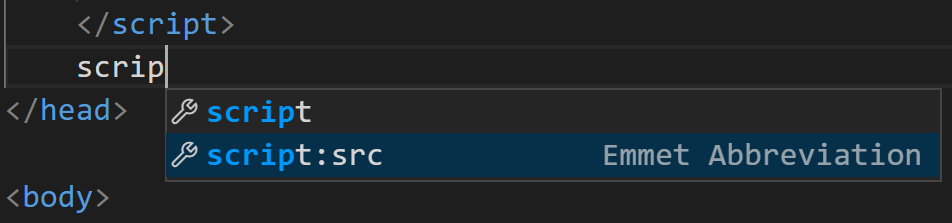
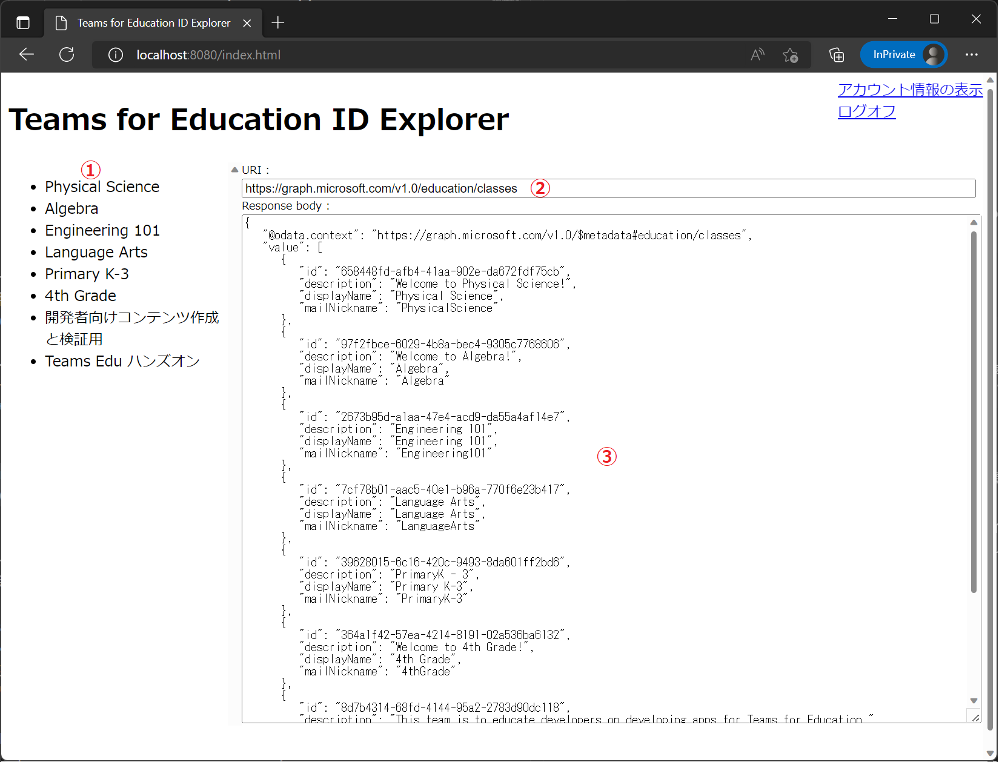
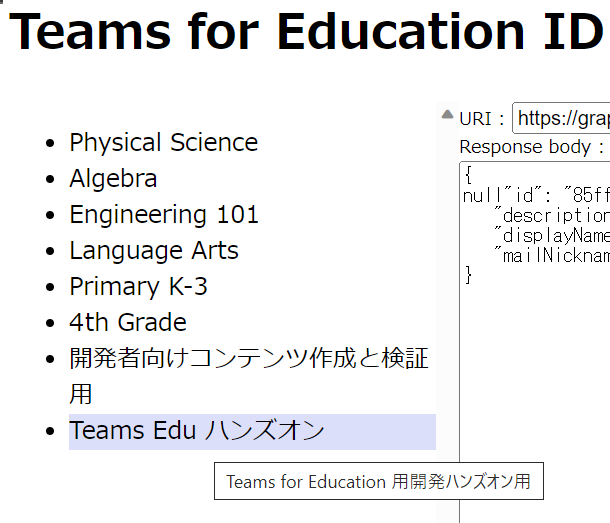
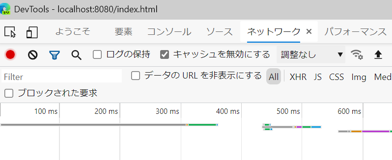
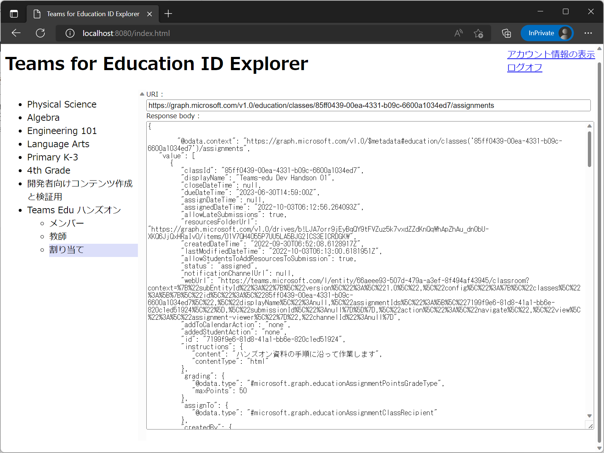
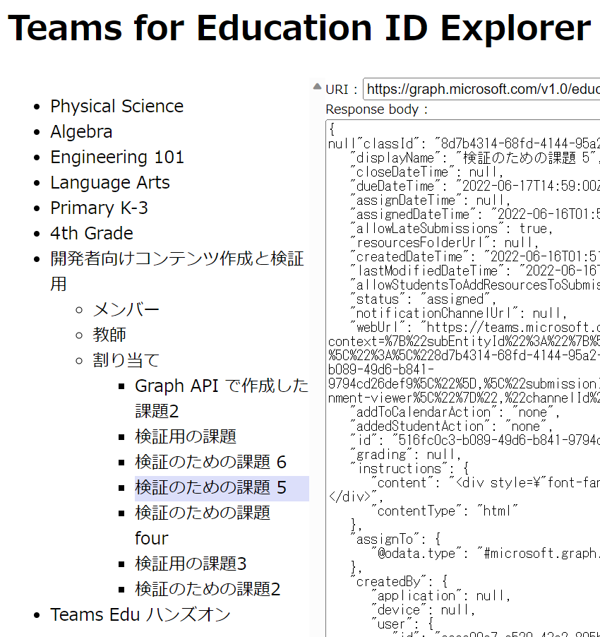

# 演習 2 - 4 ) Graph API を使用した機能の実装

Graph API の機能を利用したアプリの機能を実装します。

具体的には、Teams for Education 固有のリソースである \[クラス\] -　\[メンバーの一覧\]、\[教師の一覧\]、\[割り当ての一覧\] をドリルダウンで取得して表示します。

この機能を使用すると、Teams for Education 関連の Graph API を呼び出す際に必要になるリソースの ID をアプリの GUI で調べることができます。

## 1. クラスの一覧の取得と表示

ログオンしているユーザーアカウントに割り当てられたクラスの一覧を Graph API を使用して取得して表示し、クリックされたクラスの情報を表示する機能を実装します。

具体的な手順は以下のとおりです。

### 手順

1. この演習で作成した SPA のプロジェクトフォルダーを Visual Studio Cide でオーブンし、**index.html** を編集状態にします 

2. index.html 内の、手順 2-2 で記述した aadAuth.js を参照する script タグの下で **script** とタイプして表示される候補から **script:src** を選択します

    

3. script タグが挿入され src 属性の " (ダブルクォーテーション) 内にカーソルが移動するので **graph.js** と記述します

4. 記述したファイル名 graph.js を\[Crtl\] キーを押下しながらクリックすると"**'graph.js を開くことができません'**" と書かれたメッセージボックスが表示されるので \[**ファイルの作成**\] ボタンをクリックします

5. graph.js ファイルが作成され編集状態になるのでエディタ画面に以下のコードを貼り付けます

    ```
    //ツリーをクリックする度に API をコールしないように、取得したデータを保持するストア
    let dataStore = {},
        //前回アクティブだったツリーアイテムを保持 (選択インジケーターを消すのに使用)
        previouseSelectedItem = null;

    //HTTP リクエストを送信
    async function callGraphAPI(endpoint, token) {
        const headers = new Headers();
        //Authorization ヘッダーに Bearer + アクセス Token で API にアクセス
        const bearer = `Bearer ${token}`;
        headers.append('Authorization', bearer);
        const options = {
            method: 'GET',
            headers: headers
        };
        const res = await fetch(endpoint, options);
        return res.json();
    }

    //クリックされた要素にマーク
    function markSelected(element) {
        if (previouseSelectedItem) {
            previouseSelectedItem.className = '';
        }
        element.className = 'selectedItem';
        previouseSelectedItem = element;
    }

    //アカウントに割り当てられているクラスの一覧を取得して表示
    function getClassList(accessToken) {
        //クラス一覧を取得する Graph API のエンドポイント
        const ENDPOINT_CLASS_LIST = 'https://graph.microsoft.com/v1.0/education/classes';
        //アクセストークンを使用して Graph API を呼び出す
        callGraphAPI(ENDPOINT_CLASS_LIST, accessToken).then(data => {
            reqEndpoint.value = ENDPOINT_CLASS_LIST;
            responseView.value = JSON.stringify(data, null, 3);
            let ul = document.createElement('ul');
            ul.style.display = 'block';
            for (const item of data.value) {
                dataStore[item.id] = JSON.stringify(item, null, 3).replace('   ', null, '\n\t');
                let li = document.createElement('li');
                li.setAttribute('data-res-id', item.id);
                li.setAttribute('title', item.description);
                li.innerText = item.displayName;
                li.onclick = (event) => {
                    const element = event.target,
                        class_ID = element.getAttribute('data-res-id');
                    //API の呼び出し回数を減らすために一覧取得時にキャッシュした内容を表示します。
                    //そのため @odata.context は null になります
                    responseView.value = dataStore[class_ID];
                    reqEndpoint.value = ENDPOINT_CLASS_LIST + '/' + class_ID;
                    markSelected(element);

                     /* このコメントを演習 2-4-2 手順 3 のコードと置き換えます */  
                    
                };
                ul.appendChild(li);
            }
            treeView.appendChild(ul);
        });

    }
    ```
    キーボードの\[**Alt**\] + \[**Shift**\] + \[**F**\] キーを押下してコードのインデントを整形し、その後、 キーボードの\[**Ctrl**\] + \[**S**\] キーを押下し、変更内容を保存します

6. ファイル **aadAuth.js** を開き、関数 **handleResponse** 内のコメント /* **このコメントを演習 2-4-1 手順 5 のコードと置き換えます** */ を以下のコードで置き換えます

    ```
    //graph.js 内のクラス一覧を取得する関数を呼び出す
    getClassList(response.accessToken);
    ```

    キーボードの\[**Ctrl**\] + \[**S**\] キーを押下し、変更内容を保存します

7. Visua Studio Code のメニュー\[**ターミナル**\]-\[**新しいターミナル**\]をクリックし、表示されたターミナル画面に以下のコマンドを記述してキーボードの\[Enter\] キーを押下して http-server (ローカルWebサーバー)のサービスを開始します
    ```
    http-server
    ```
8. Web ブラウザーを起動し、Azure Active Airectory にアプリケーションとして登録した URL である[http://localhost:8080/index.html](http://localhost:8080/index.html) にアクセスします

9. 表示されたページの右上にあると **\[ログオン\]** リンクをクリックするとサインインイン用のポップアップウィンドウが表示されるので アプリケーションを登録した Azure Active Directory のアカウントを選択してログインします

10. 画面左にクラスの一覧 ① が表示され、左側のテキストボックスにクラスの一覧を取得した際のエンドポイント②、その下のテキストエリアに Graph API から返された JSON が表示されていることを確認します

    

    また、リストされているクラス名をクリックすると、クラス名に選択されたことを示すマーカがつき、左側のテキストボックスとテキストエリアの内容も更新されることを確認してください。

    

ここまでの手順で、Graph API を使用して、ログオンしたユーザー アカウントに割り振られたクラスの一覧を取得して表示する機能を実装しました。

> **注:** もし、コードを修正してもページの内容が更新されない場合は、Web ブラウザーの画面でキーボードの\[**F12**\]キーを押下して開発者ツールを起動し、ページのキャッシュを無効にしてからページを更新してください。キャッシュの無効化は開発者ツールの \[ネットワーク\]メニューで行います。

つづいて、各クラスに紐づいているメンバーの一覧や、割り当て(課題)の一覧を取得して表示する機能を実装します。


<br><br>

## 2. クラスに紐づくリソースの取得と表示

リストされた各リストに紐づく、メンバーと教師、割り当て(課題) の一覧データを取得して表示する機能を実装します。

具体的に手順は以下のとおりです。

### 手順

1. この演習で作成した SPA のプロジェクトフォルダーを Visual Studio Cide でオープンし、ファイル **graph.js** の最後に以下のコードを貼り付けて追加します

    ```
    function createClassChildren(id, accessToken) {
        const endpointSwitch = [
            { key: 'members', displayName: 'メンバー' },
            { key: 'teachers', displayName: '教師' },
            { key: 'assignments', displayName: '割り当て' }
        ];
        const ul = document.createElement('ul');
        for (let cnt = 0; cnt <= 2; cnt++) {
            const li = document.createElement('li');
            li.innerText = endpointSwitch[cnt].displayName;
            li.setAttribute('data-res-id', `${id}/${endpointSwitch[cnt].key}`);
            li.onclick = (event) => {
                const element = event.target,
                    endpointId = element.getAttribute('data-res-id');
                const parentEndpoint = 'https://graph.microsoft.com/v1.0/education/classes/';
                element.style.cursor = 'wait';
                markSelected(element);
                callGraphAPI(parentEndpoint + endpointId, accessToken).then(data => {
                    reqEndpoint.value = parentEndpoint + endpointId;
                    responseView.value  = JSON.stringify(data, null, 3).replace('   ', '\n\t');
                    element.style.cursor = 'pointer';
                    
                    /* このコメントをオプション 1 の手順のコードと置き換えます */

                });
                event.stopPropagation();
            }
            ul.appendChild(li);
        }
        return ul;
    }
    ```
2. graph.js の関数 **getClassList** 内のコメント /* **このコメントを演習 2-4-2 手順 3 のコードと置き換えます** */ を以下のコードで置き換えます

    ```
    if (element.children.length > 0) {
         element.children[0].style.display =(element.children[0].style.display == 'block') ? 'none' : 'block';
    } else {
        element.appendChild(createClassChildren(element.getAttribute('data-res-id'), accessToken));
    }
    ```

    キーボードの\[**Alt**\] + \[**Shift**\] + \[**F**\] キーを押下してコードのインデントを整形し、その後、 キーボードの\[**Ctrl**\] + \[**S**\] キーを押下し、変更内容を保存します

3. Visua Studio Code のメニュー\[**ターミナル**\]-\[**新しいターミナル**\]をクリックし、表示されたターミナル画面に以下のコマンドを記述してキーボードの\[Enter\] キーを押下して http-server (ローカルWebサーバー)のサービスを開始します
    ```
    http-server
    ```
4. Web ブラウザーを起動し、Azure Active Airectory にアプリケーションとして登録した URL である[http://localhost:8080/index.html](http://localhost:8080/index.html) にアクセスします

5. 表示されたページの右上にあると **\[ログオン\]** リンクをクリックするとサインインイン用のポップアップウィンドウが表示されるので アプリケーションを登録した Azure Active Directory のアカウントを選択してログインします

10. 画面左にクラスの一覧が表示されるので、任意のクラス名をクリックすると、クラス名の下に \[**メンバー**\]、\[**教師**\]、\[**割り当て**\] という要素が追加されており、クリックするとそれぞれ情報を取得するためのエンドポイントと、レスポンスされた内容が画面左のテキストボックスとテキストエリアに表示されるのを確認してください

    

ここまでの手順で、Graph API を使用して、ログインしたユーザーアカウントが割り振られたクラスの一覧を取得し、各々のクラスに紐づいたリソースの情報を取得する SPA (Single Page Application) の作成作業は完了です。

> **注:** コードを修正してもページの内容が更新されない場合は、Web ブラウザーの画面でキーボードの\[**F12**\]キーを押下して開発者ツールを起動し、ページのキャッシュを無効にしてからページを更新してください。キャッシュの無効化は開発者ツールの \[ネットワーク\]メニューで行います。

もしうまくいかない場合は [**サンプル**](samples/Ex02-4) の内容を参考にしてください。

<br><br>

## オプション

演習で作成した SPA は、あくまでもアプリケーションからアクセストークンを入手する方法と Graph API を呼び出す方法の紹介するための最低限の機能しか実装していません。

しかし、このアプリケーション実行をするとアクセストークンと Teams for Education のリソースを Graph API で操作するための ID が取得できますので、[**演習 1-1**](Ex01-1.md) での作業を参考に、より深い階層にある割り当て(課題)や申請の列挙や、[**演習1 -2**](Ex01-2.md) での作業を参考に、それらの新規作成機能を実装しても良いかも知れません。 

たとえば、以下のコードをファイル **graph.js** の最後に貼り付け、

```
//割り当て(課題) の一覧を取得する
function createAssignmentChildren(endpointId, accessToken) {
    const parentEndpoint = 'https://graph.microsoft.com/v1.0/education/classes/';
    const endpoint_assignmentList = parentEndpoint + endpointId;
    let ul = document.createElement('ul');
    callGraphAPI(endpoint_assignmentList, accessToken).then(data => {
        reqEndpoint.value = endpoint_assignmentList;
        responseView.value = JSON.stringify(data, null, 3);
        ul.style.display = 'block';
        for (const item of data.value) {
            dataStore[item.id] = JSON.stringify(item, null, 3).replace('   ', null, '\n\t');
            let li = document.createElement('li');
            li.setAttribute('data-res-id', item.id);
            li.setAttribute('title', item.description);
            li.innerText = item.displayName;
            li.onclick = (event) => {
                const element = event.target;
                reqEndpoint.value = endpoint_assignmentList + '/' + element.getAttribute('data-res-id') ;
                responseView.value = dataStore[element.getAttribute('data-res-id')];
                markSelected(element);
                event.stopPropagation();
            }
            ul.appendChild(li);
        }
    });
    return ul;
}
```

同ファイルの関数 **createClassChildren** 内のコメント、 /* **このコメントをオプション 1 の手順のコードと置き換えます** */ を以下のコードで置き換えアプリケーションを実行すると、

```
if (endpointId.split('/')[1] == 'assignments') {
    if (element.children.length > 0) {
        element.children[0].style.display = (element.children[0].style.display == 'block') ? 'none' : 'block';
    } else {
        element.appendChild(createAssignmentChildren(endpointId, accessToken));
    }
}
```

画面左のリストビューに割り当て(課題)のリストが追加され、クリックすると情報を確認することができるようになります。



なお、新規作成や更新の機能を追加する場合は必ず、使用する API が必要とする権限(スコープ)を [API リファレンス](https://learn.microsoft.com/ja-jp/graph/api/overview?view=graph-rest-1.0)で確認し、Azure Active Directory の \[アクセス許可の追加\] で必要な権限を追加してくたさい。

<br><br>

## まとめ

演習 2 では SPA に Graph API を使用して Microsoft Teams for Education のクラス以下のリソースの情報を取得して表示する機能を実装しました。

この演習を通して、Azure Active Directory へのアプリケーションの登録や MSAL.js を使用したアクセストークンの取得について体験することができました。

なお、このハンズオンでは SPA でチュートリアルを作成しましたが、MSAL には様々な開発言語のチュートリアルが用意されていますので、SPA 以外での開発をされる方は以下を参考にしてください。

- [Android](https://docs.microsoft.com/ja-jp/azure/active-directory/develop/tutorial-v2-android)
- [iOS と MacOS](https://docs.microsoft.com/ja-jp/azure/active-directory/develop/tutorial-v2-ios)
- [Windows プラットフォーム(UWP)](https://docs.microsoft.com/ja-jp/azure/active-directory/develop/tutorial-v2-windows-uwp)
- [Windows デスクトップ アプリ(.NET)](https://docs.microsoft.com/ja-jp/azure/active-directory/develop/tutorial-v2-windows-desktop)

## 参考資料
- [Microsoft ID プラットフォームのドキュメント](https://docs.microsoft.com/ja-jp/azure/active-directory/develop/)
- [Microsoft Graph のドキュメント](https://docs.microsoft.com/ja-JP/graph/)

<br><br>

次の演習 3 では、シングルサインオン機能を備えた Teams タブ アプリケーションを作成します。

_ _ _

👉 [**演習3) Teams タブ アプリの作成**](Ex03-0.md)へ

👈 [演習 2 - 3) MSAL.js を使用したアクセス トークンの取得](Ex02-3.md) 

[🏚️ README に戻る](README.md)


