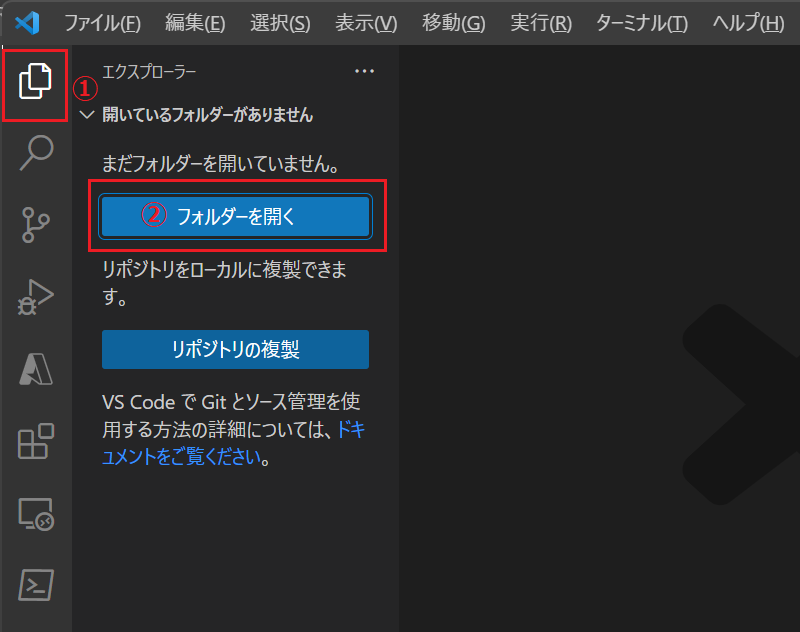
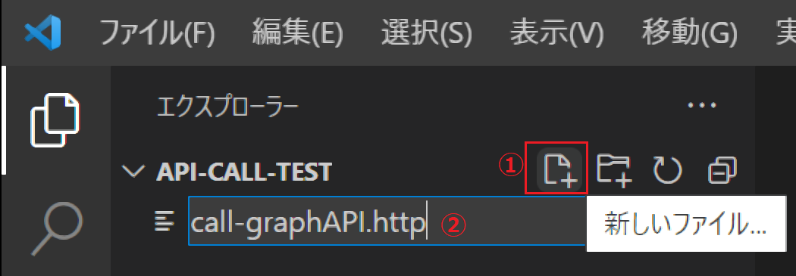
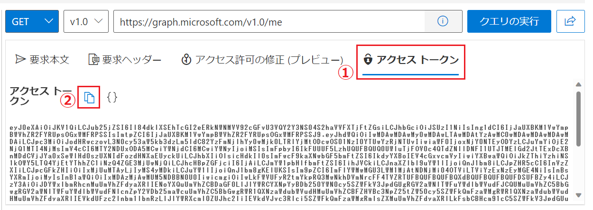
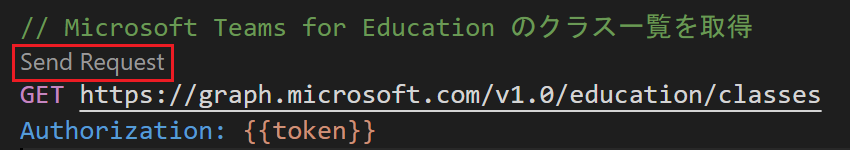

# 演習 1 - 2) REST クライアント ツールを使用した Graph API の呼び出しと Teams for Education の課題の作成と割り当て

この演習では、一般的な HTTP/REST クライアントツールとしての Visual Studio Code の [REST Client 拡張](https://marketplace.visualstudio.com/items?itemName=humao.rest-client) を使用して Graph API のリクエストの構造を学びながら Teams for Education の課題の作成や、課題へのリンク、ファイルの添付方法を体験します。

以下のツールがインストールされていない場合は、リンク先からインストールをお願いします。

* **[Visual Studio Code](https://code.visualstudio.com/Download)**

* Visual Studio Code **[REST Client 拡張](https://marketplace.visualstudio.com/items?itemName=humao.rest-client)**

なお、[**Postman**](https://www.postman.com/downloads/) や **cURL** コマンドなど、既に使い慣れた HTTP/REST ツールがある場合は、操作方法をそちらに置き換えて演習を行っても問題はありません。

## 演習の準備

### 演習で使用するファイルの入手

この演習では、新規に作成した**課題**にファイルを添付しますので、添付用のファイルとして以下の pdf ファイルをダウンロードしおいてください。

* [**Microsoft Teams for Education クイックスタートガイド**](https://edudownloads.azureedge.net/msdownloads/MicrosoftTeamsforEducation_QuickGuide_JA-JP.pdf)


### Visual Studio Code REST Client 拡張の準備

ローカル環境に作業フォルダーを作成し、Visual Studio Code で参照し、REST Client 拡張を使用するための *.http ファイルを作成します。

具体的な手順を以下のとおりです。

1. Visual Studio Code を起動し、画面左のツールバーの最上部にある**エクスプローラー** アイコンをクリックし、表示されたブレードの \[**フォルダーを開く**\] をクリックして任意の作業フォルダーを指定します

    

2. エクスプローラー画面で、フォルダー名の右側に表示される \[**新しいファイル**\] アイコンをクリックして、**call-GraphAPI.http** という名前でファイルを作成します

    

3. 作成したファイル **call-GraphAPI.http** に以下の内容をコピーして貼り付けます。

    ```
    ### アクセストークンの指定
    //このコメントを演習 1-2 手順 3 の内容で置き換え 


    ### Microsoft Teams for Education のクラス一覧を取得
    //このコメントを演習 1-2 手順 4 の内容で置き換え 


    ### クラス ID の指定
    //このコメントを演習 1-2 手順 5 の内容で置き換え 


    ### 任意のクラスに割り当て(課題)を下書きの状態で作成
    //このコメントを演習 1-2 手順 6 の内容で置き換え 


    ### 作成した割り当て(課題) ID を指定
    //このコメントを演習 1-2 手順 7 の内容で置き換え 


    ### 割り当て(課題)にリンクを添付
    //このコメントを演習 1-2 手順 8 の内容で置き換え 


    ### 割り当て(課題)に添付するためのファイルをアップロードするリソースフォルダを作成
    //このコメントを演習 1-2 手順 9 の内容で置き換え 


    ### リソースフォルダのパスを指定
    //このコメントを演習 1-2 手順 10 の内容で置き換え 


    ### 割り当て(課題)に添付するファイルをリソースフォルダーにアップロード
    //このコメントを演習 1-2 手順 11 の内容で置き換え 


    ### 割り当て(課題)にリソースフォルダーのファイルを添付
    //このコメントを演習 1-2 手順 12 の内容で置き換え 


    ### 割り当(課題) の発行
    //このコメントを演習 1-2 手順 12 の内容で置き換え 

    ```


以上、Visual Studio Code の REST Client 拡張から HTTP リクエスト送信する準備ができました。

<br><br>

## REST クライアント ツールを使用した Graph API の呼び出し

Graph API の呼び出しは Bearer 認証方式( [RFC6750](https://datatracker.ietf.org/doc/html/rfc6750) )を採用採用した一般的な REST API と同様に、Authorization ヘッダーに bearer 事前に入手したアクセストークンを含めてリクエストを送ることで呼び出せます。

アクセストークンを入手するには、Microsoft Teams for Education がある Azure Active Directory へのアプリケーションの登録や、認証のためのプログラミングが必要になりますが、この演習では作業を簡単にするために Graph Explorer が取得したアクセス トークンをコピーして使用します。

なお、プログラムコードを使用したアクセス トークンの入手方法は、演習 2　で Single Page Application(SPA) を作成する際に説明します。

ここからは、Visual Studio Code の REST Client 拡張から Graph API を呼び出し、Microsoft Teams for Education のクラスに新規で**課題** を作成し、生徒に割り当てるまでの手順を体験します。

具体的な手順は以下のとおりです。

### 手順

1. [**Graph エクスプローラー**](https://developer.microsoft.com/ja-jp/graph/graph-explorer) にサインインします

2. エンドポイントを指定するバーの下にある \[**アクセス トークン**\] タブをアクティブにします
    
    アクセス トークンが表示されるので、同タブ内のコピーアイコンを使用してコピーします。

    

3. 以下の構文の **%コピーしたアクセストークン%** の部分を Graph エクスプローラーからコピーしたアクセストークンで書き換え、Visual Studio Code で前の手順で作成したファイル call-GraphAPI.http のコメント **//このコメントを演習 1-2 手順 3 の内容で置き換え** を上書きして置き換えます

    ```
    @token = Bearer %コピーしたアクセストークン%
    ```

    なお、このアクセストークンの長さは 1 時間ですので、演習中に Expire した場合は再度 Graph エクスプローラーからコピーし直してください。

4. ファイル call-GraphAPI.http のコメント **//このコメントを演習 1-2 手順 4 の内容で置き換え** を以下の記述で置き換えます

    ```
    GET https://graph.microsoft.com/v1.0/education/classes
    Authorization: {{token}}
    ```

    構文を貼り付けるとエンドポイントの上に **Send Request** という文字が表示されるのでクリックします

    

    画面右側に新しくビューが開き、API サーバーから返された JSON が表示されるので、演習 1 - 1 で使用したクラスの名前を探します。ただし、日本語はコード化されてしまっているので displayName の値が **"Teams Edu \u30cf\u30f3\u30ba\u30aa\u30f3"** となっているものを探し **id** の GUID をコピーします
    
5. 以下の **%コピーしたクラス ID%** の部分を前の手順でコピーした GUID で書き換え

    ```
    @class-id = %コピーしたクラス ID%
    ```

    ファイル call-GraphAPI.http のコメント **//このコメントを演習 1-2 手順 5 の内容で置き換え** を上書きします

6. Class-ID を指定したクラスに**割り当て(課題)**を下書き状態で作成します

    以下の構文でファイル call-GraphAPI.http のコメント **//このコメントを演習 1-2 手順 6 の内容で置き換え** を上書きし、エンドポイントの上に表示された **Send Request** をクリックします

    ```
    POST https://graph.microsoft.com/v1.0//education/classes/{{class-id}}/assignments
    Authorization: {{token}}
    Content-Type: application/json

    {
        "displayName": "Teams-edu Dev Handson 01",
        "dueDateTime": "2023-06-30T14:59:00Z",
        "instructions": {
            "content": "ハンズオン資料の手順に沿って作業します",
            "contentType": "text"
        },
        "grading": {
            "@odata.type": "#microsoft.graph.educationAssignmentPointsGradeType",
            "maxPoints": 50
        },
        "assignTo": {
            "@odata.type": "#microsoft.graph.educationAssignmentClassRecipient"
        },
        "status": "draft",
        "allowStudentsToAddResourcesToSubmission": "true"
    }
    ```

    画面右側のビューに返された JSON の **id** の値をコピーして保持します。

    Teams クライアントにサインインして \[課題\] メニューの \[下書き\] タブに **Teams-edu Dev Handson 01** という課題が作成されていることを確認してください。

7.  前の手順でコピーした 割り当て(課題) の **id** の値で、以下の **%コピーした割り当て ID%** 部分を書き換え、

    ```
    @assignment-id = %コピーした割り当て ID%
    ```

    ファイル call-GraphAPI.http のコメント **//このコメントを演習 1-2 手順 7 の内容で置き換え** を上書きします

8. 作成した 割り当て(課題) に Web サイトへのリンクを添付します

    ファイル call-GraphAPI.http のコメント **//このコメントを演習 1-2 手順 8 の内容で置き換え** を以下の構文で上書きし、エンドポイントの上に表示された **Send Request** をクリックします

    ```
    POST https://graph.microsoft.com/v1.0/education/classes/{{class-id}}/assignments/{{assignment-id}}/resources
    Authorization: {{token}}
    Content-type: application/json

    {
        "distributeForStudentWork": false,
        "resource": {
            "displayName": "Microsoft Teams オンライン & リモート学習 | Microsoft Education",
            "link": "https://www.microsoft.com/ja-jp/education/products/teams",
            "thumbnailPreviewUrl": null,
            "@odata.type": "#microsoft.graph.educationLinkResource"
        }
    }
    ```
9. 割り当て(課題) に、ローカルからアップロードしたファイルを添付します

    ただし、これを行うには以下の 3 つの処理を順番に行う必要があります。

    1. 割り当て(課題)に紐づいたリソース フォルダの作成
    2. リソースフォルダへのファイルのアップロード
    3. アップロードされたファイルの情報を含む 割り当て(課題) のリソースアイテムを作成

    

    ```
    POST https://graph.microsoft.com/v1.0/education/classes/{{class-id}}/assignments/{{assignment-id}}/setUpResourcesFolder
    Authorization: {{token}}
    Content-Type: application/json

    {}
    ```

    
