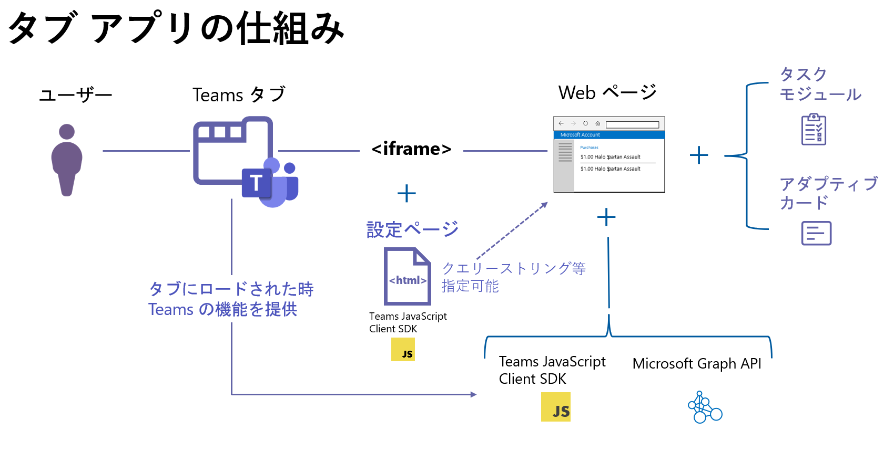

# 演習3 ) Teams タブ アプリの作成
インターネット上にホストされている Web ページは、Teams アプリ用のマニフェスト ファイルに Web ページへの参照を記述することでタブ アプリとして Teams にインストールすることができます。

## タブ アプリ

Teams タブ アプリでは、既存の Web ページを Teams のタブとして追加したり、Teams のタブ アプリに独自に備わった機能を利用して、より Teams に統合された機能を実装することができます。

タブ アプリの用途としては、アプリケーションの UI として、大きな表示エリアが必要となるシナリオに向いています。
たとえばタスクや製品などの一覧や、さまざまグラフや表、地図などが張り付いたダッシュボートの表示など、広い表示領域が必要な場合です。

Teams タブには静的タブと、タブを追加する際に条件や設定をユーザーが設定することができる構成可能タブというのがあります。
また、Teams 独自の機能に Web ページの JavaScript からアクセスするためのライブラリとして Teams JavaScript Client SDK が用意されています。



タブ アプリは iframe で実現されているため Web ページ側の設定が iframe の使用を許可しない X-Frame-Options : DENY に設定されている場合はタブ アプリとして使用できないので注意が必要です。
また、ページ内の JavaScript でウィンドウ関連のイベントを取得している場合も注意が必要です。

また、 Teams タブ内の Web ページは特別なコンテキストで動作しており、[**Teams JavaScript client SDK**](https://learn.microsoft.com/ja-jp/microsoftteams/platform/tabs/how-to/using-teams-client-sdk?source=recommendations&tabs=javascript%2Cmanifest-teams-toolkit#apis-organized-into-capabilities) を使用して Microsoft Teams が提供する機能にアクセスすることができます。

<br>

## 演習 3 の内容

この演習ではシンプルな Microsoft Teams のタブ アプリを作成し、Teams JavaScript client SDK を使用して Microsoft Teams との シングルサインオン(Single Sign-On : SSO) を実装します。

SSO を使用すると、Microsoft Graph API を呼び出す際に必要となるアクセストークンを取得する際、認証ダイアログボックスを表示することなくシームレスに処理を行うことができます。

なお、この演習で作成するタブ アプリは以下の 2 種類です。

* **静的(パーソナル)タブ**

    パーソナルなスコープのタブです。個々のユーザーをサポートします。

    たとえば、職位や給与に関する情報や有給休暇の所得状況、トレーニングの受講状況など、他者と共有しないユーザー毎のパーソナルな情報を扱うアプリに向いています。パーソナル タブを使用すると、ユーザーは自分だけの情報をチーム全体で共有することなく利用できます。

* **構成可能(チャネル)タブ**

    チャネル単位のスコープのタブです。静的タブがユーザーごと利用であるのに対し、構成可能タブはチャネルの一部になり、チャネルを参照可能なチームのメンバーにおなじ情報を提供します。構成可能タブには、コンテンツページに加えてタブとして追加されるページの初期設定を行う構成ページがあります。

Teams タブ アプリのより詳しい内容については、以下のリンク先をご参照ください。

* Microsoft Teams 開発者向け簡易チュートリアル - [**演習 2 : タブ アプリケーション**](https://github.com/osamum/Easyway-for-MSTeamsAppDev/blob/master/Ex02.md#%E6%BC%94%E7%BF%92-2--%E3%82%BF%E3%83%96-%E3%82%A2%E3%83%97%E3%83%AA%E3%82%B1%E3%83%BC%E3%82%B7%E3%83%A7%E3%83%B3)

* Microsoft Learn -  [**Microsoft Teams タブ**](https://learn.microsoft.com/ja-jp/microsoftteams/platform/tabs/what-are-tabs)

<br>

## 演習の準備

この演習を行うには Microsoft Teams のサブスクリプションの他に以下のツールが必要ですので、あらかじめインストールを行っておいてください。

* **[Visual Studio Code](https://code.visualstudio.com/Download)**

* [**Node.js**](https://nodejs.org/en/)

 
* **[ngrok](https://ngrok.com/download)**

    ローカル環境で動作させた開発中のアプリケーションをインターネットを介して一時的にアクセスできるようにするために使用します。 Node.js が使用可能な場合は、以下のコマンドを使用してインストールすることも可能です。

    ```
    npm install ngrok -g
    ```
<br>
ここまでの手順で演習の準備は完了です。

以降、実際に Teams タブ アプリを作成していきます。
<br><br>
_ _ _
👉 [**演習 3 - 1 ) 静的(パーソナル)タブの作成**](Ex03-1.md)へ

[**戻る**](Ex01-1.md) 👈