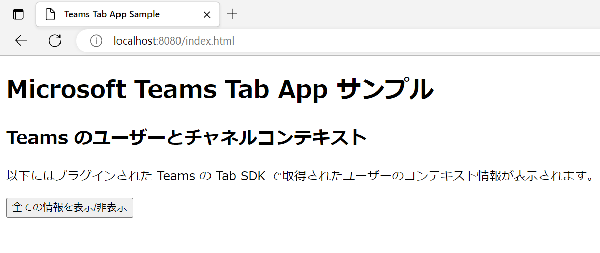
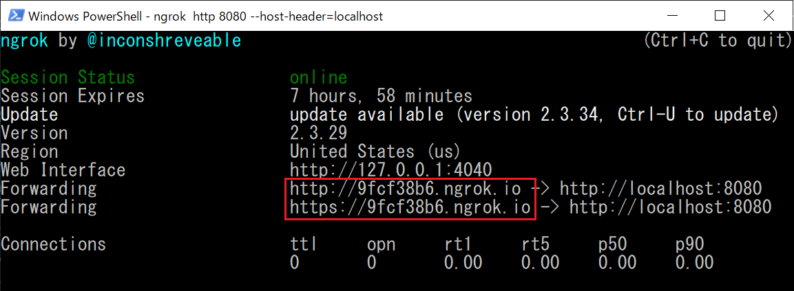
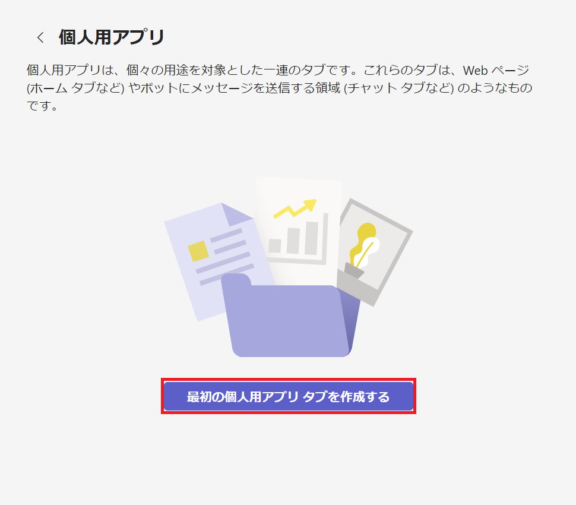
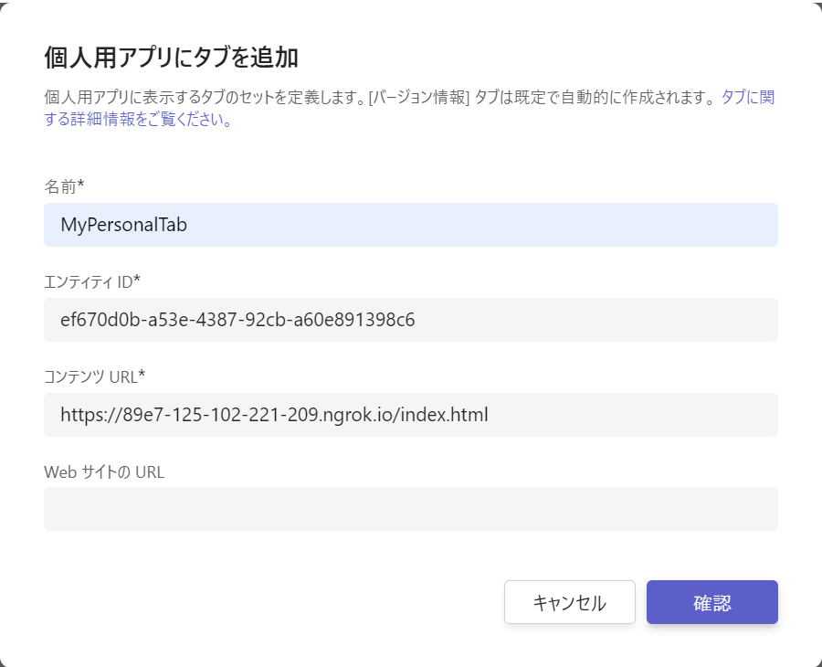
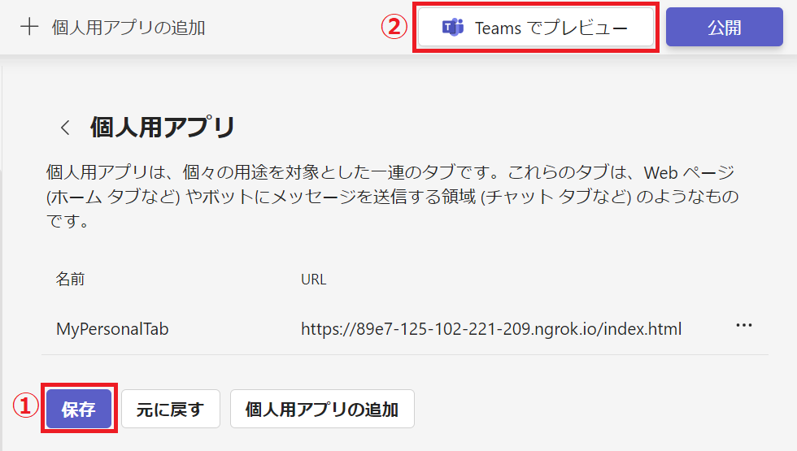
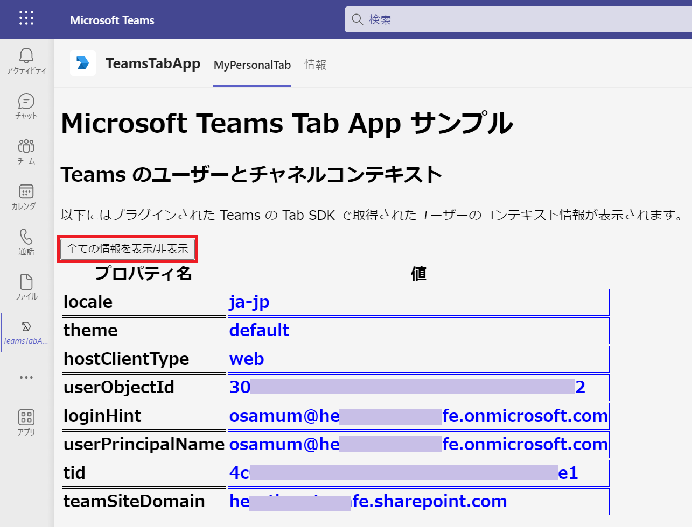
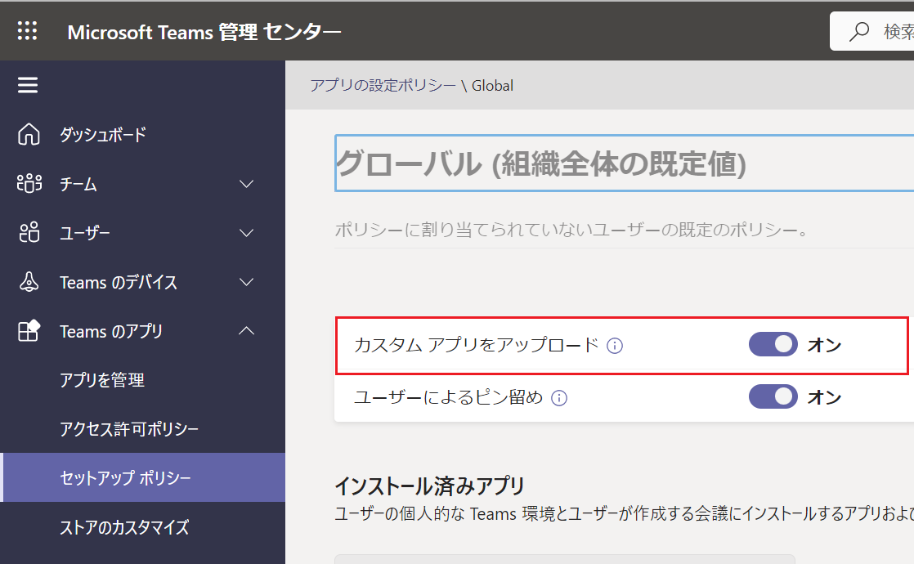

# 演習 3 - 1 ) 静的(パーソナル)タブの作成

このタスクでは Web ブラウザーと Teams タブのコンテキストの違いを理解いただくために Teams JavaScript client SDK で Teams を使用しているユーザーの情報を取得して表示するたけのシンプルな静的タブを作成します。

作業内容は以下のとおりです。

1. [**Web ページの作成**](#%E3%82%BF%E3%82%B9%E3%82%AF-1--web-%E3%83%9A%E3%83%BC%E3%82%B8%E3%81%AE%E4%BD%9C%E6%88%90)
2. [**Teams アプリの基本情報の登録**](#%E3%82%BF%E3%82%B9%E3%82%AF-2--teams-%E3%82%A2%E3%83%97%E3%83%AA%E3%81%AE%E5%9F%BA%E6%9C%AC%E6%83%85%E5%A0%B1%E3%81%AE%E7%99%BB%E9%8C%B2)
3. [**Teams へのタブ アプリのインストールと実行**](#%E3%82%BF%E3%82%B9%E3%82%AF-3--web-%E3%83%9A%E3%83%BC%E3%82%B8%E3%82%92%E3%83%91%E3%83%BC%E3%82%BD%E3%83%8A%E3%83%AB-%E3%82%BF%E3%83%96%E3%81%A8%E3%81%97%E3%81%A6%E8%BF%BD%E5%8A%A0)

ここから上記 3 つの作業の具体的に手順を紹介します。

<br><br>

## タスク 1 : Web ページの作成

タブ アプリとして使用するシンプルな Web ページを作成し、ローカル環境で正常にホストできることを確認します。その後、ngrok を使用してトンネリングを行いインターネット経由でアクセスできるか確認します。

具体的な手順は以下のとおりです。

### 手順

1. コマンドプロンプトを起動し、cd コマンドで作業ディレクトリを任意の場所に切り替えます

2. mkdir コマンドを使用してディレクトリ teamsTab を作成します 
    ```
    mkdir teamsTab
    ```
3. cd コマンドを使用して、作業ディレクトリを teamsTab に切り替えます 
    ```
    cd teamsTab
    ```

4. 以下のコマンドを使用して Visual Studio Code を起動します。 
    ```
    code .
    ```
5. Visual Studio Code のメニュー \[**File**\] - [New File] クリックします。

6. メニュー \[**File**\] - \[**Save As...**\] をクリックし、ファイルを **index.html** という名前で保存します。(※ファイルを保存する際、保存ダイアログボックスで \[ファイルの種類\] を HTML を指定するようにしてください )

7. Visual Studio Code で開かれている index.html に以下の内容をコピーして貼り付けます。
    ```
    <!DOCTYPE html>
    <html lang="ja">
    <meta name="viewport" content="width=device-width">
    <meta charset="utf-8" />
    <head>
        <title>Teams Tab App Sample</title>
        <style>
            table {
                font-weight: bold;
                font-size: 20px;
            }

            .context-data {
                color: blue;
            }

            .other-data {
                display: none;
            }

            td {
                border: 1px solid;
            }

        </style>
        <!-- Microsoft Teams JavaScript Client 2.0 SDK  (via CDN) -->
        <script src="https://res.cdn.office.net/teams-js/2.2.0/js/MicrosoftTeams.min.js"
            integrity="sha384yBjE++eHeBPzIg+IKl9OHFqMbSdrzY2S/LW3qeitc5vqXewEYRWegByWzBN/chRh" crossorigin="anonymous">
            </script>
    </head>

    <body>
        <h1>Microsoft Teams Tab App サンプル</h1>
        <h2>Teams のユーザーとチャネルコンテキスト</h2>
        <p>以下にはプラグインされた Teams の Tab SDK で取得されたユーザーのコンテキスト情報が表示されます。 </p>

        <button id="visibleCtrlButton">全ての情報を表示/非表示</button>
        <div id="display"></div>

        <script>
            let $id = (id) => { return document.getElementById(id); }
            let display, videoFrame, videoContainer;

            //microsoftTeams クラスの初期化(v2.0 から promise を返す)
            microsoftTeams.app.initialize().then(() => {

                //Microsoft Teams のユーザーコンテキストを取得
                //※ v2.0 から promise を返すはずですが、2022月12月現在そうなっていないのでコールバック関数で context を取得
                microsoftTeams.getContext((context) => {
                    //このサンプルでは取得した context を表を描画する関数 renderGrid に引数として渡していますが、
                    //この箇所で const userPrincipalName = context.userPrincipalName; のような記述でプロパティにアクセスできます。
                    $id('display').appendChild(renderGrid(context));
                });

                //[表示/非表示] ボタンのクリック時のアクション
                $id('visibleCtrlButton').addEventListener('click', () => {
                    const otherRows = document.querySelectorAll('.other-data');
                    for (const row of otherRows) {
                        if (row.style.display) {
                            row.style.display = (row.style.display == 'table-row') ? 'none' : 'table-row';
                        } else {
                            row.style.display = 'table-row';
                        }
                    }

                });
                
                /*ここに演習 3-2 で コードを追加*/

            });
            

            //オブジェクトのプロパティ名を値を列挙して表 (table エレメントとして返す)
            function renderGrid(obj) {
                const table = document.createElement('table'),
                    headerTr = document.createElement('tr'),
                    nameTh = document.createElement('th'),
                    valueTh = document.createElement('th');
                nameTh.innerText = 'プロパティ名';
                valueTh.innerText = '値';
                headerTr.appendChild(nameTh);
                headerTr.appendChild(valueTh);
                table.appendChild(headerTr);

                for (let propName in obj) {
                    const tr = document.createElement('tr'),
                        nameTd = document.createElement('td'),
                        valueTd = document.createElement('td');
                    nameTd.innerText = propName;
                    if (propName === 'userPrincipalName' || propName === 'userObjectId'
                        || propName === 'locale' || propName === 'theme' || propName == 'loginHint'
                        || propName == 'hostClientType' || propName === 'teamSiteDomain'
                        || propName === 'tid') {
                        valueTd.className = 'context-data';
                    } else {
                        tr.className = 'other-data';
                    }

                    if (obj[propName] instanceof Object) {
                        valueTd.appendChild(renderGrid(obj[propName]));
                    } else {
                        valueTd.innerText = obj[propName];
                    }
                    tr.appendChild(nameTd);
                    tr.appendChild(valueTd);
                    table.appendChild(tr);
                }
                return table;
            }

        </script>
    </body>

    </html>
    ```
    \[**Ctrl**]\ + \[**S**\] キーを押下して変更を保存します。

8. Visual Studio Code のメニュー \[**表示**\] - \[**ターミナル**\] をクリックします

9. ターミナルウインドウで以下のコマンドを実行します。
    ```
    http-server
    ```
    もし、http-server が起動しない場合は Readme の \[[要件](Readme.md#要件)] の内容を確認してください。

10. Web ブラウザーを起動し、以下の URL にアクセスします。
    ```
    http://localhost:8080/index.html
    ```
    以下の内容が表示されることを確認してください。

    

    Teams のタブでロードされていないので、ユーザーの情報がロードされておらず \[全ての情報を表示/非表示\] ボタンも動作しません
<br>

### インターネットへのトンネリング
ローカルで動作している Web サーバーに Microsoft Teams がアクセスできるよう、ngrok を使用してトンネリングをおこないます。

1. Visual Studio Code のメニュー \[Terminal\] - \[New Terminal\] をクリックします。

2. 画面下部にターミナルウインドウが表示されるので、同ウィンドウ内で以下のコマンドを実行します。

    ```
    ngrok http 8080 --host-header=localhost
    ```

    (※)もし、ngrok を npm でなく、ダウンロードして使用する場合はコマンドプロンプトで作業ディレクトリを ngrok.exe のあるディレクトリとし、cmd コマンドでシェルを切り替えたあとコマンドを実行してください。

3. エコーされた内容の Forwarding の横に表示された **https** のドメイン名を使用してアクセスします。

    

    たとえば、ngrok から返されたドメイン名が https://9fcf38b6.engrok.io だった場合は以下の URL でインターネットからローカルの default.html にアクセスすることができます。 

    https://9fcf38b6.engrok.io/index.html

    ローカル アドレスでアクセスしたときと同じコンテンツが表示されることを確認してください。

    **なお、engrok は終了すると、次回起動したときにドメイン名が変わってしまうので注意してください。**

ここまでの手順で、作成した Web ページに Microsoft Teams からアクセスできるようになりました。

<br />

## タスク 2 : Teams アプリの基本情報の登録

作成した Web ページをタブとして追加する前に、機能の追加先となる Teams アプリの基本情報の入力を行います。

この設定には Microsoft Teams 用 [**Developer Portal**](https://dev.teams.microsoft.com/home) (開発者ポータル)を使用します。

**【重要】以下のドキュメントの内容に従い、Teams アプリの基本情報の登録を行ってください。** 

* Microsoft Teams 開発者向け簡易チュートリアル - [**演習 1 : Microsoft Teams アプリケーションの新規作成**](https://github.com/osamum/Easyway-for-MSTeamsAppDev/blob/master/Ex01.md#%E6%BC%94%E7%BF%92-1--microsoft-teams-%E3%82%A2%E3%83%97%E3%83%AA%E3%82%B1%E3%83%BC%E3%82%B7%E3%83%A7%E3%83%B3%E3%81%AE%E6%96%B0%E8%A6%8F%E4%BD%9C%E6%88%90){:target="_blank"}

Teams アプリの基本情報が登録が完了後、次のタスクに進みます。

<br />


## タスク 3 : Web ページをパーソナル タブとして追加

ローカル環境でホストされている Web コンテンツを Microsoft Teams にパーソナル タブとして追加します。

この設定には引き続き Microsoft Teams 用 [**Developer Portal**](https://dev.teams.microsoft.com/home) (開発者ポータル)を使用します。

具体的な手順は以下のとおりです。

### 手順

Web サイトである Microsoft Teams 用 開発者ポータルを使用してパーソナル タブの追加を行います。

具体的な手順は以下のとおりです。

1. Web ブラウザーから [**Developer Portal**](https://dev.teams.microsoft.com/) にアクセスし、Teams アプリ開発に使用するアカウントでログインします

2. 画面左のメニューバーの\[**アプリ**\] をクリックしすると、アプリの一覧が表示されるので、一覧から[前の手順](https://github.com/osamum/Easyway-for-MSTeamsAppDev/blob/master/Ex01.md#%E6%BC%94%E7%BF%92-1--microsoft-teams-%E3%82%A2%E3%83%97%E3%83%AA%E3%82%B1%E3%83%BC%E3%82%B7%E3%83%A7%E3%83%B3%E3%81%AE%E6%96%B0%E8%A6%8F%E4%BD%9C%E6%88%90){:target="_blank"} で登録したアプリ **My first app** をクリックします

3. アプリの設定画面に遷移するので、画面左のメニューから \[**構成する**\]-\[**アプリの機能**\] を選択します

4. 機能の一覧が表示されるので \[**個人用アプリ**\] のタイルをクリックします

    

5. 遷移した先の画面で \[**最初の個人用アプリ タブを作成する**\] アイコンか、画面上部の　\[**+ 個人用タブの追加**\] メニューをクリックします

    

6. **個人用アプリにタブを追加**ダイアログボックスが表示されるので、各項目を以下のように設定します

    |項目|値|
    |---|---|
    | 名前* | MyPersonalTab |
    | エンティティ ID* | 既定で設定されているGUID |
    | コンテンツ* | ngrok でホストされている URL |
    | Web サイト URL | 入力なし |

    実際の画面は以下の通りです。

    

    <!--
    メモ
    https://marketplace.visualstudio.com/items?itemName=ms-vscode.live-server
    -->

    \[**確認**\] ボタンをクリックします

7. **個人用アプリ** 画面に遷移するので、同画面の \[**保存**\]ボタンをクリックします。画面上部のグリーンのバーが表示され「個人用タブが正常に更新されました」とメッセージされるので、続いて上部にある \[**Teams でプレビュー**\] ボタンをクリックします

    

8. Web ブラウザーが起動し、アラート ボックスに「**このサイトは、Microsoft Teams を開こうとしています。**」と表示されるので、デスクトップ アプリで試す場合は同アラート ボックス内の \[開く\] ボタンをクリックします。 Web ブラウザーに Teams をロードして試す場合は、同アラート ボックスの \[**キャンセル**\] ボタンをクリック後、Web ブラウザーのドキュメント ウィンドウ内の \[**代わりに Web アプリを使用**\] ボタンをクリックします

9. **My first app** のインストール ダイアログボックスが表示されるので \[**追加**\] ボタンをクリックします。

    Teams 内にタブとして作成した Web ページが表示され、以下のように現在 Teams を使用しているユーザーの情報が表示されていることを確認してください。

    

    またタブ アプリ内の \[**全ての情報を表示/非表示**\] ボタンをクリックし、他にどのような値が取得出来ているかを確認してください。

    > 【注】もし Teams アプリのインストール ダイアログからのインストールが失敗し、権限関連のエラーメッセージが返る場合は、[Microsoft Teams 管理センター](https://admin.teams.microsoft.com) の[セットアップポリシー](https://admin.teams.microsoft.com/policies/app-setup/) の画面で \[**グローバル (組織全体の既定値)**\]の\[**カスタムアプリのアップロード**\] が有効になっているかご確認ください。

    

<br><br>

ここまでの手順で Teams のパーソナル タブの作成は完了です。

もしうまくいかない場合は [**サンプル**](samples/Ex03-1/index.html) の内容を参考にしてください。

次のタスクでは、今回作成したタブ アプリに構成用ページを新規に追加して構成可能(チーム)タブ を実装します。 

\<参考\>

* [**Microsoft Teams タブのコンテキストを取得する**](https://docs.microsoft.com/ja-jp/microsoftteams/platform/concepts/tabs/tabs-context)

* [**Microsoft Teams の個人用タブを作成する**](https://docs.microsoft.com/ja-jp/microsoftteams/platform/concepts/tabs/tabs-static)

<br><br>
_ _ _

👉 [**演習 3 - 2 ) 構成可能(チーム)タブの作成**](Ex03-2.md) へ

👈 [演習3 ) Teams タブ アプリの作成](Ex03-0.md) へ

[🏚️ README に戻る](README.md)