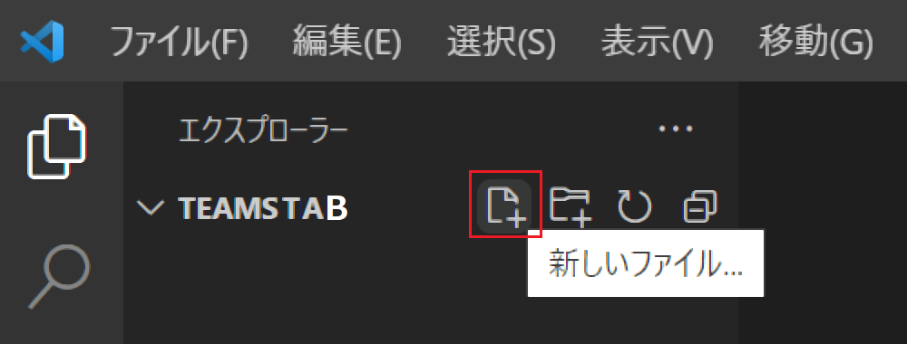
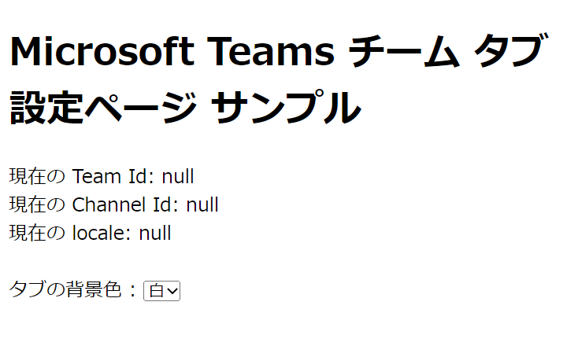
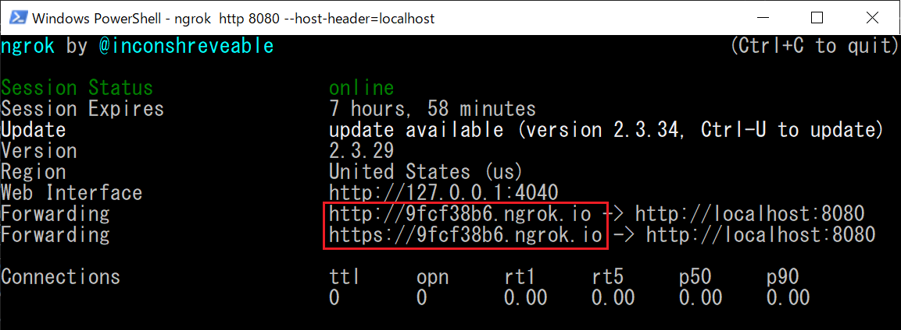
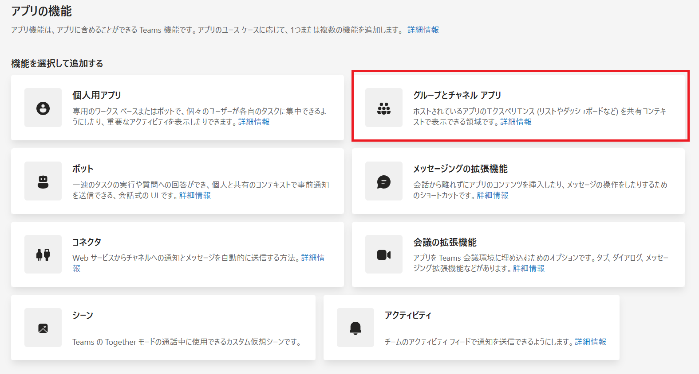
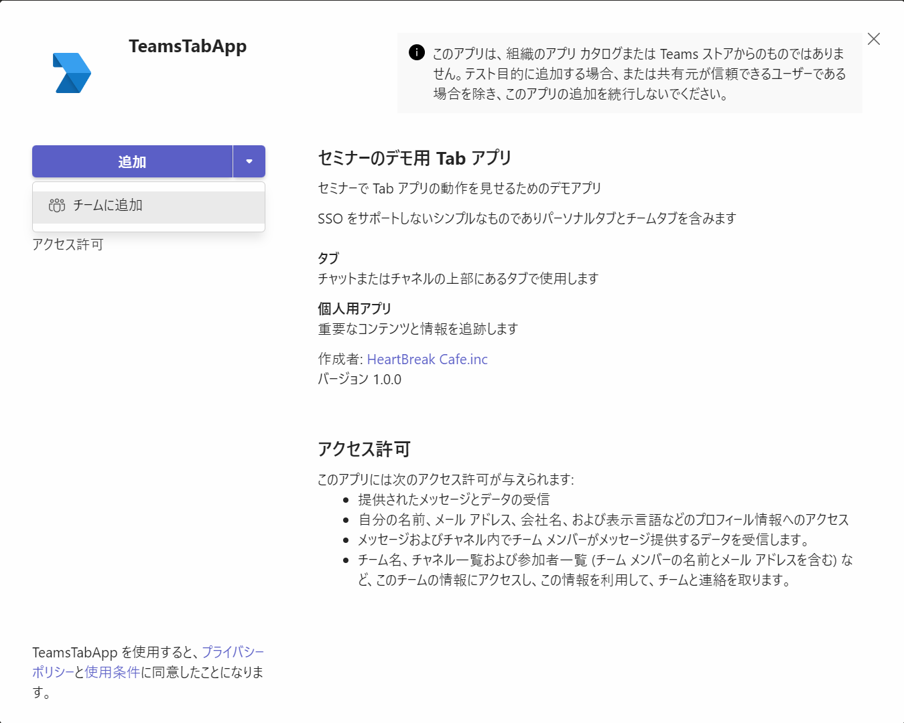
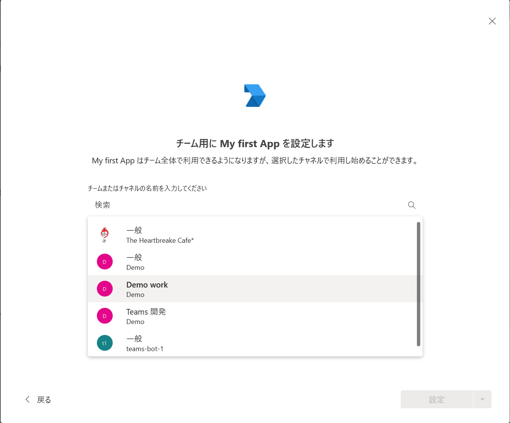
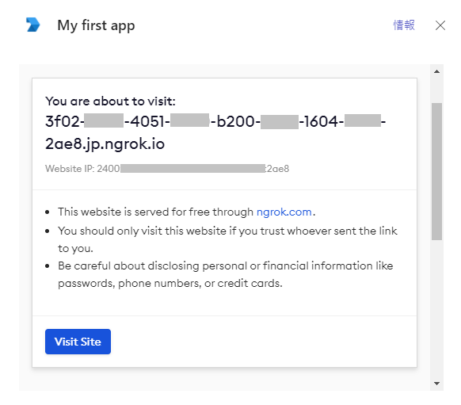
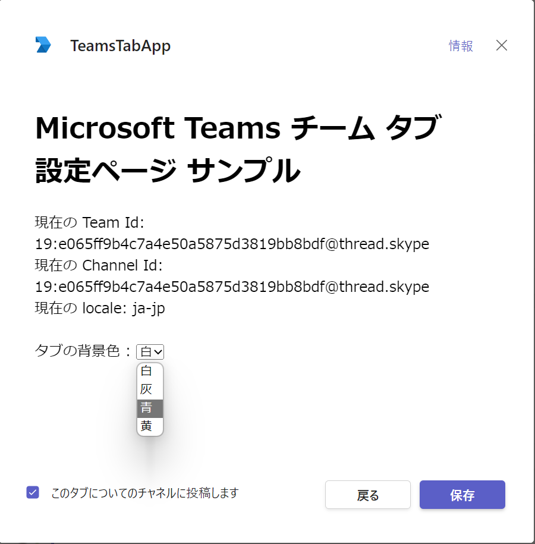
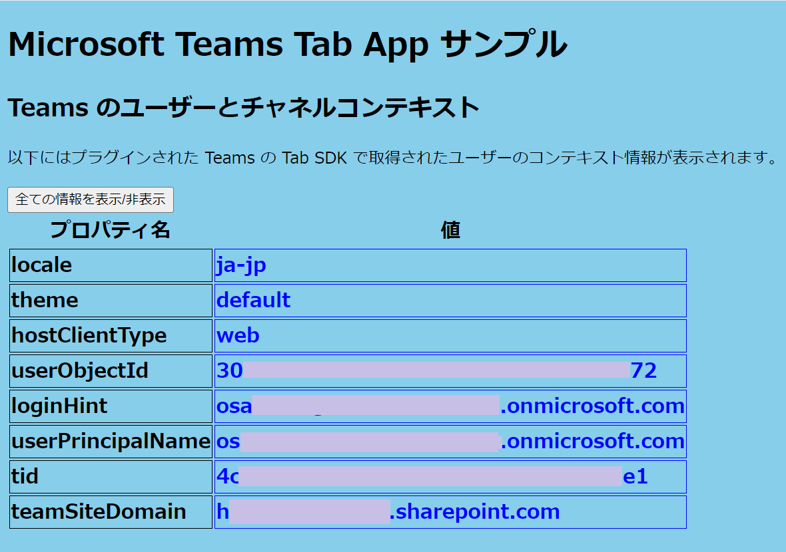
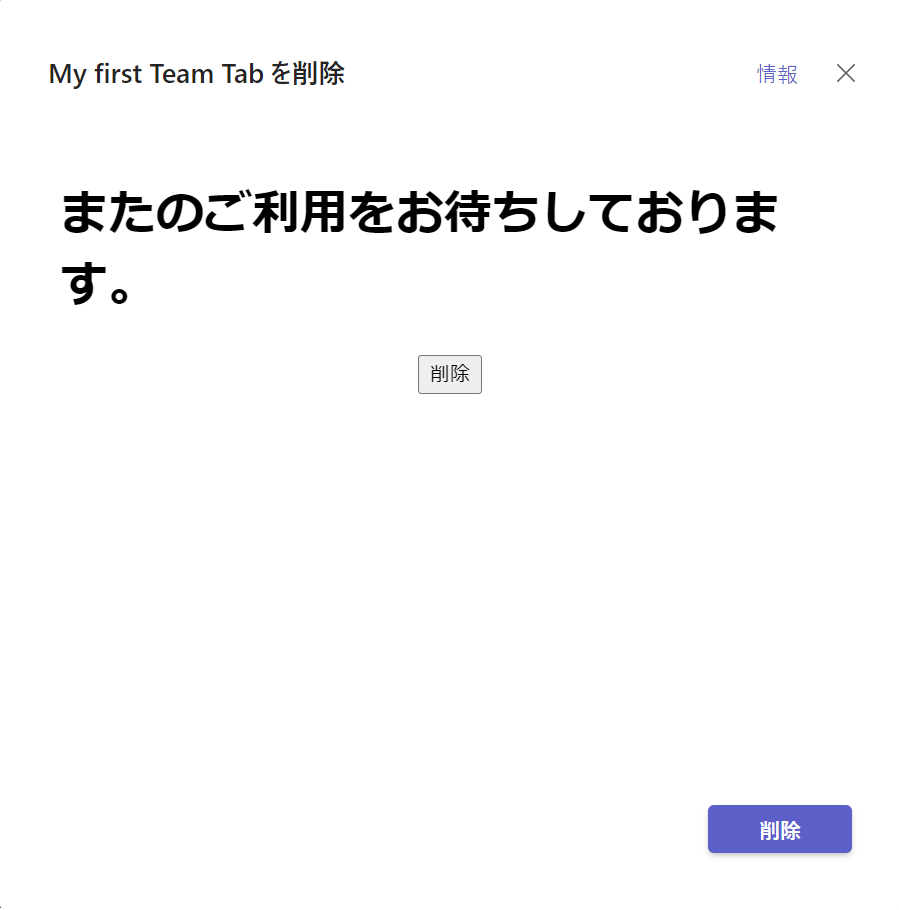

# 演習 3 - 2 ) 構成可能(チーム)タブの作成

ローカル環境でホストされている Web コンテンツを Microsoft Teams にチーム タブとして追加します。

パーソナル タブの追加方法とは異なり、タブとして追加される Web ページ以外に設定 (構成) 用のページを作り、その中から Microsoft Teams JavaScript client SDK の [microsoftTeams.settings.setSettings メソッド](https://docs.microsoft.com/en-us/javascript/api/@microsoft/teams-js/microsoftteams.settings?view=msteams-client-js-latest#setsettings-settings-) を使用して登録を行います。

なお、以降の手順はタスク 1 でパーソナル タブ用として作成した Web ページを使用しますので、作成していない場合はタスク 1 の内容を参考に作成しておいてください。


## チームタブ 設定ページの作成

Microsoft Teams にチーム タブを追加する際に表示される設定ダイアログボックス用の Web ページを作成します。

なお、開発者ポータルでのチーム タブの登録に使用するのは、この設定ページの URL です。

手順は以下のとおりです。

### 手順

1. タスク 1 で作成したパーソナル タブ用の Web ページのフォルダを Visual Studio Code でオープンします。

2. 画面左のツリービュー内にあるフォルダ名 \[teamsTab\] の右隣にある \[新しいファイル\]アイコンをクリックし、表示されたテキストボックスに config.html と入力してファイル **config.html** を作成します

    

3. Visual Studio Code で開かれている **config.html** に以下の内容をコピーして貼り付けます。

    ```
    <!DOCTYPE html>
    <html>
    <head>
        <meta charset="utf-8" />
        <title>Team Tab Config.</title>
        <!-- Microsoft Teams JavaScript API (via CDN) -->
        <script src="https://statics.teams.microsoft.com/sdk/v1.5.2/js/MicrosoftTeams.min.js"
        crossorigin="anonymous"></script>
        <!--SDK v2.0 が正しく動作しないため v1.5.2 を使用-->
    </head>
    <body>
        <h1>Microsoft Teams チーム タブ<br>設定ページ サンプル</h1>
         <div id="currentTeam"></div>
        <div id="currentChannel"></div>
        <div id="currentLocale"></div>
        <br>

        タブの背景色 : 
        <!--タブとして追加されるページの背景色を指定-->
        <select id="colorSelector" >
            <option value="white" >白</option>
            <option value="gainsboro">灰</option>
            <option value="skyblue">青</option>
            <option value="yellow">黄</option>
        </select>
        <script>
            let colorName = '';
            microsoftTeams.initialize();
            microsoftTeams.settings.registerOnSaveHandler(function (saveEvent) {
                microsoftTeams.settings.setSettings({
                    entityId: 'myteamtab',
                    contentUrl: 'ngrok の ドメイン名/index.html' + colorName,
                    suggestedDisplayName: 'My first Team Tab',
                    websiteUrl: '',
                    removeUrl: 'ngrok の ドメイン名/remove.html',
                });
                saveEvent.notifySuccess();
            });
            microsoftTeams.settings.setValidityState(true);
            document.getElementById('colorSelector').addEventListener('change',(evnt)=>{
                colorName = '?' + evnt.target.value;
            });

            document.getElementById('currentTeam').innerText = `現在の Team Id: ${getValueFromQueryString('team')}`;
        document.getElementById('currentChannel').innerText = `現在の Channel Id: ${getValueFromQueryString('channel')}`;
        document.getElementById('currentLocale').innerText = `現在の locale: ${getValueFromQueryString('locale')}`;

        //URL のクエリーストリングから指定されたパラメーターの値を返す
        function getValueFromQueryString(paramName) {
            const urlParams = new URLSearchParams(document.location.search.substring(1));
            return urlParams.get(paramName);
        }
        </script>
    </body>
    </html>
    ```
    \[Ctrl\] + \[S\] キーを押下して変更を保存します。

4. Teams の UI からタブを削除した際に表示するページを作成します。メニュー \[**File**\] - \[**Save As...**\] クリックし、ファイルを **remove.html** という名前で保存します。(※ファイルを保存する際、保存ダイアログボックスで \[**ファイルの種類**\] を HTML を指定するようにしてください )

5. Visual Studio Code で開かれている **remove.html** に以下の内容をコピーして貼り付けます。

    ```
    <!DOCTYPE html>
    <html lang="ja">
    <head>
        <meta charset="UTF-8">
        <meta http-equiv="X-UA-Compatible" content="IE=edge">
        <meta name="viewport" content="width=device-width, initial-scale=1.0">
        <title>Document</title>
        <!-- Microsoft Teams JavaScript API (via CDN) -->
    <script src="https://statics.teams.microsoft.com/sdk/v1.5.2/js/MicrosoftTeams.min.js"
        crossorigin="anonymous"></script>
    <!--SDK v2.0 が正しく動作しないため v1.5.2 を使用-->
    <style>
        button {
            margin-left: auto;
            margin-right: auto;
            display: block;
        }
    </style>
    </head>
    <body>
        <h1>またのご利用をお待ちしております。</h1>
    
        <button onclick="onClick()">このタブを削除</button>
        <script>
            microsoftTeams.initialize();
            microsoftTeams.settings.registerOnRemoveHandler((removeEvent) => {
                microsoftTeams.settings.getSettings((settings) => {
                settings.contentUrl = 'ngrok の ドメイン名/index.html'
                });
                removeEvent.notifySuccess();
            });
    
            const onClick = () => {
                microsoftTeams.settings.setValidityState(true);
            }

        </script>
    </body>
    </html>
    ```

    \[Ctrl\] + \[S\] キーを押下して変更を保存します。

6. Visual Studio Code のメニュー \[表示\] - \[ターミナル\] をクリックします。

7. ターミナルウインドウで以下のコマンドを実行します。
    ```
    http-server
    ```
    もし、http-server が起動しない場合は Readme の \[[要件](Readme.md#要件)] の内容を確認してください。

8. Web ブラウザーを起動し、以下の URL にアクセスします。

    ```
     http://localhost:8080/config.html
    ```
    以下の内容が表示されることを確認してください。

    

9. Visual Studio Code のメニュー \[ターミナル\] - \[新しいターミナル\] をクリックします。

10. 画面下部にターミナルウインドウが表示されるので、同ウィンドウ内で以下のコマンドを実行します。

    ```
    ngrok http 8080 --host-header=localhost
    ```

    (※)もし、ngrok を npm でなく、ダウンロードして使用する場合はコマンドプロンプトで作業ディレクトリを ngrok.exe のあるディレクトリとし、cmd コマンドでシェルを切り替えたあとコマンドを実行してください。

11. エコーされた内容の Forwarding の横に表示された **https** のドメイン名を使用してアクセスします。

    

    たとえば、ngrok から返されたドメイン名が https://9fcf38b6.engrok.io だった場合は以下の URL でインターネットからローカルの default.html にアクセスすることができます。 

    https://9fcf38b6.engrok.io/config.html

    ローカル アドレスでアクセスしたのと同じコンテンツが表示されることを確認してください。

    なお、ngrok はこの手順が完了するまで絶対に終了しないでください。

12. Visual Studio Code で開かれている **config.html** の \<script\> タグ内のコード中の「**ngrok の ドメイン名**」と書かれている箇所を ngrok の **https** のドメイン名に書き換え、キーボードの \[Ctrl] + \[S] キーを押下して保存します。

13. Visual Studio Code でタスク 1 で作成した **index.html** を開きます。

14. \<script\> タグの中のコードにあるコメント「**\/* ここに演習 3-2 で コードを追加*/**」を以下のコードで置き換えます。
    ```
    // URL に付加された色名から背景色を設定
    ((qString)=>{
        document.body.style.backgroundColor = (qString)? (qString.substr(1,qString.length -1)):''; 
    })(window.location.search);
    ```

    キーボードの \[Shift\] + \[Alt\] + \[F\] を押下してコードのインデントを整えます。

    \[Ctrl\] + \[S\] キーを押下して変更を保存します。

ここまでの作業で、チーム タブの設定画面の作成は完了です。

<br><br>

## Teams チーム タブとして追加

前の手順で作成した設定ページを使用して、ローカル環境でホストされているページを Microsoft Teams にチーム タブとして追加します。

具体的な手順は以下のとおりです。

### 手順

1. Web ブラウザーから [Developer Portal](https://dev.teams.microsoft.com/) にアクセスし、Teams アプリ開発に使用するアカウントでログインします

2. 画面左のメニューバーの\[**アプリ**\] をクリックしすると、アプリの一覧が表示されるので、一覧から演習 1 で登録したアプリ **My first app** をクリックします

3. アプリの設定画面に遷移するので、画面左のメニューから \[**構成する**\]-\[**アプリの機能** \] を選択します

4. 機能の一覧が表示されるので \[**グループとチャネルアプリ**\] のタイルをクリックします

    

5. **グループとチャネル アプリ**の設定ページが表示されるので、各項目を以下のように設定します

    |項目|値|
    |---|---|
    | 構成 URL(※) | https://ngrokで払い出されたドメイン名/config.html?team={teamId}&channel={channelId}&locale={locale} |
    |Users can reconfigure the app| チェック|
    | 範囲 | チーム : チェック <br>グループ チャット : チェック |
    | コンテキスト | channelTab |
    | SharePoint の設定 (該当する場合) | チェックしない|

    > 【メモ】 今回の\[**構成 URL**\] の設定では URL に、クエリーストリング "?team={teamId}&channel={channelId}&locale={locale}" を追加していますが、これは config.html 内のコードでこのクエリーストリングを介して渡されるチーム ID、チャネル ID、ロケールを取得いるためです。単に config.html を表示してチームタブの設定を行う場合には必要ありません。

    \[**保存**\] ボタンをクリックします。

6. 同画面上部にある\[**Teams でプレビュー**\] ボタンをクリックします

7. Web ブラウザーが起動し、アラート ボックスに「**このサイトは、Microsoft Teams を開こうとしています。**」と表示されるので、デスクトップ アプリで試す場合は同アラート ボックス内の \[開く\] ボタンをクリックします。 Web ブラウザーに Teams をロードして試す場合は、同アラート ボックスの \[**キャンセル**\] ボタンをクリック後、Web ブラウザーのドキュメント ウィンドウ内の \[**代わりに Web アプリを使用**\] ボタンをクリックします

8. My first app のダイアログボックスが表示されるので \[**チームに追加**\] ボタンをクリックします。
    
    

9. チームタブを追加するチームの一覧がドロップダウンされるので、任意のチーム名を選択し\[**タブを設定**\]ボタンをクリックします

    

    > 【注】タイミングによっては、チームがまったく表示されないことがありますので、もしチームの一覧が表示されない場合は、目的のチームの名前を入力し、検索を行ってください

10. 前述の手順で作成した config.html が設定ダイアログボックスとして表示されるので(※1)、

    > 【注 1 】お使いの環境によっては、"You are about to visit : (ngrok が生成したドメイン名)" と書かれたページが表示される場合があります。その場合は同ページ内にある \[**Visit Site**\] ボタンをクリックして手順を続行してください。

    > 

    現在の Team Id、Channel Id(※2) およびロケールが表示されているのを確認します。これらの値は Graph API を使用する際に便利です。

    > 【注 2 】現在(2022/12)、Team Id、Channel Id には、両方とも現在のチャネルの ID が返り、Team Id は取得できません。今後の修正を待ちましょう。参考 : [構成ページを作成する - クエリ文字列を含むベース URL](https://learn.microsoft.com/ja-jp/microsoftteams/platform/tabs/how-to/create-tab-pages/configuration-page?tabs=teamsjs-v2#base-url-with-query-strings)

    config.html 内の \[タブの背景色] ドロップダウンリストボックスから任意の色名を選択して \[保存] ボタンをクリックします。

    

11. 選択したチャネルにタブが追加され、表示されたタブの背景色が以下のように設定ダイアログボックスで指定した色になっていることを確認してください。

    

    また、追加したタブの削除を行った際に remove.html が表示されることもご確認ください。

    

以上で、演習 3 - 2 ) 構成可能(チーム)タブの作成は完了です。

もしうまくいかない場合は [**サンプル**](samples/Ex03-2) の内容を参考にしてください

次の演習では、認証ダイアログボックス表示せずにタブ アプリを認証し、アクセストークンの入手を行うことができるシングルサインオンの機能を実装します。

次の演習では新しくプロジェクトを作成しますので、ここまでの作業で使用した Visual Studio Code は終了してください。

\<参考\>

* [**構成ページを作成する**](https://docs.microsoft.com/ja-jp/microsoftteams/platform/concepts/tabs/tabs-configurable)
* [**削除ページを作成する**](https://learn.microsoft.com/ja-jp/microsoftteams/platform/tabs/how-to/create-tab-pages/removal-page?tabs=teamsjs-v2)

<br><br>
_ _ _

👉 [**演習 3 - 3 ) タブ アプリへのシングルサインオン(SSO)の実装**](Ex03-3.md)へ

👈 [演習 3 - 1 ) 静的(パーソナル)タブの作成](Ex03-1.md) 

[🏚️ README に戻る](README.md)