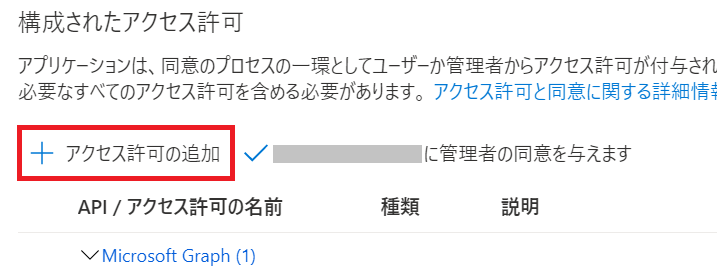

# 演習 3 - 3 ) タブ アプリへのシングルサインオン(SSO)の実装

Microsoft Teams を使用する際、ユーザーは Microsoft アカウントで Microsoft Teams にサインインします。デスクトップやモバイルのクライアントでTeams タブやタスクモジュールを認証するためのシングルサインオンを可能にすることで、アプリ毎にサインインする必要が無くなり、機能的な統一感が保たれるだけでなくパフォーマンスとロードタイムが向上します。

## この演習で実装するシングルサインオンの仕組み

Microsoft Teams のタブ アプリでは、Azure Active Directory とアプリ マニフェストを適切に設定し、タブ アプリのコードから [Teams Client JavaSctipt SDK](https://docs.microsoft.com/en-us/javascript/api/@microsoft/teams-js/?view=msteams-client-js-latest) の [getAuthToken メソッド](https://docs.microsoft.com/en-us/javascript/api/@microsoft/teams-js/microsoftteams.authentication?view=msteams-client-js-latest#getAuthToken_AuthTokenRequest_)を呼び出すことでユーザーのメール アドレスなど情報を抽出することのできるアクセストークンを取得できます。

しかし、getAuthToken メソッドで取得できるアクセス トークンは、ユーザーレベルの Graph API パーミッション（email、profile、offline_access、OpenId）しかサポートしていないため、User.Read や Mail.Read など、他の Graph スコープへのアクセスが必要な場合は、このトークンを必要なスコープを含むトークンに交換する必要があります。

この演習では、Teams Client JavaSctipt SDK を使用して入手したトークンを、他のGraph API (の Mail.Read)を呼び出すことのできるスコープを持ったトークンに交換し、一覧を取得する機能を実装します。

## 前提条件

この演習を行うには、[**演習 3-1**](Ex03-1.md)、[**演習 3-2**](Ex03-2.md) で**タブ アプリケーション**の作成方法を学習済みであるか、同等の知識を有していることが大前提となります。


## 演習の流れ
今回の処理は、Azure Active Directory へのアプリの登録、アプリマニフェストの設定を適切に行い、静的ページで動作するシンプルなプライベート タブ アプリを作成します。

同タブ アプリ内の JavaScript コードから Teams JavaScript Clienrt SDK の getAuthToken メソッドを呼び出してアクセス トークンを取得し、それを OAuth2.0 の [**On-Behalf-Of(代理) フロー**](https://docs.microsoft.com/ja-jp/azure/active-directory/develop/v2-oauth2-on-behalf-of-flow)を使用して異なるスコープを持ったトークンに交換します。

この代理フロー処理はクライアント側の JavaScript では行えないため、簡単な REAST API を作成してこれを呼び出して行い、交換後のアクセストークンを使用して Graph API が呼び出せることを確認します。

具体的には以下のような順序で演習を進めます。

1. [**シンプルなプライベート タブ アプリの作成**](#sso-%E3%81%AE%E3%81%9F%E3%82%81%E3%81%AE%E3%82%B7%E3%83%B3%E3%83%97%E3%83%AB%E3%81%AA%E3%82%BF%E3%83%96-%E3%82%A2%E3%83%97%E3%83%AA%E3%81%AE%E4%BD)
2. [**タブ アプリの Azure Active Directory への登録**](#azure-active-directory-%E3%81%B8%E3%81%AE%E7%99%BB%E9%8C%B2)

    ⇒ Teams 上でタブ アプリを実行し Teams Client JavaScript SDK を使用してトークンが取得できることを確認

3. [**トークンの交換を行うための REST API を作成**](#%E3%83%88%E3%83%BC%E3%82%AF%E3%83%B3%E3%82%92%E4%BA%A4%E6%8F%9B%E3%81%99%E3%82%8B%E3%81%9F%E3%82%81%E3%81%AE%E3%82%B5%E3%83%BC%E3%83%93%E3%82%B9%E3%81%AE%E4%BD%9C%E6%88%90)

    ⇒ 交換したトークンと Graph API を使用してメールの一覧が取得できることを確認

**RSET API の開発について**

トークンを交換するための REST API の開発は Microsoft ID Platform のエンドポイントに対し適切な HTTP リクエストを送信できればどのような開発言語でもかまいませんが、今回はクライアント サイドのコードと同じ JavaScript が使用できる Node.js を使用します。

Web アプリケーション開発のフレームワークとして [express](http://expressjs.com/ja/) を使用しますので以下のコマンドを実行してどのディレクトリからでも実行できるようにしておくか、特定のディレクトでのみ使用したい場合は、目的のディレクトリで -g を指定せずにコマンドをします。

```
npm install -g express
```

同様にアプリケーションのスケルトンを生成する [express-generator](https://expressjs.com/ja/starter/generator.html) もインストールします。

```
npm install -g express-generator
```

<br>

## SSO のためのシンプルなタブ アプリの作成

演習のためのシンプルなタブ アプリを作成します。

今回の演習で使用するアプリは静的な html ファイルなので、http-server (開発用の Web サーバー) でホストすることができますが、今回はトークンを交換するための REST API も作成するので Express を使用して Node.js プロジェクトを作成し、それを実行してタブアプリの html ファイルをホストします。

(※) express-generatort が生成するプロジェクトはサーバーサイドで HTML を描画するテンプレートエンジンとして [jade](https://jade-lang.com/) をサポートしていますが、今回の演習ではサーバーサイドとクライアントサイドの処理を別けて理解していただく目的でクライアントサイドは静的 html ファイルを使用します。

プロジェクト作成からパーソナルタブの追加までの具体的な手順は以下のとおりです。

1. コマンドプロンプトで、作業用のディレクトリに切り替えたら以下のコマンドを実行し、プロジェクトの雛形を生成します

    ```
    express ssoTabApp
    ```

2. プロジェクト用の **ssoTabApp** という名前のディレクトリが生成されるので、cd コマンドで作業ディレクトリを切り替え

    ```
    cd ssoTabApp
    ```

    npm install コマンドを実行して依存関係のあるモジュールをインストールします

    ```
    npm install
    ```

3. プロジェクトが正しく構成されたことを確認するために以下のコマンドを実行し、

    ```
    npm start
    ```

    Web ブラウザーのアドレスバーに以下のアドレスを入力してブラウズします

    ```
    http://localhost:3000/
    ```

    Web ブラウザーに「**Express**」と表示されることを確認後、コマンド プロンプトに戻り、キーボードの \[Ctrl\]+\[C\] キーを押下してプロジェクトの実行を停止します。

4. 作業中のコマンドプロンプトで以下のコマンドを実行し、Visual Studio Code を起動します

    ```
    code .
    ```
5. Visual Studio Code の画面左の \[エクスプローラー\] にプロジェクトを構成するフォルダとファイルがツリー表示されているので、\/**public** フォルダを右クリックし、表示されたコンテキストメニューから\[**新しいファイル**\]を選択し、**index.html** と言う名前でファイルを作成します

    

6. Visual Studio Code の編集画面に、作成した index.html が開かれた状態になっているので、**!** (エクスクラメーションマーク)を入力したらすぐにキーボードの \[Tab\] キーを押下します

7. html の基本的なタグが自動で挿入されるので、\<**html**\> タグの **lang** 属性を "en" から "**ja**" に変更し、body タグの中に以下のタグを貼り付けます

    ```
    <h1>Teams SSO タブ</h1>
    <button id="logOnButton">ログオン</button>
    <br><br>
    <div id="display"></div>
    <br><br>
    <div id="mailItems"></div>
    ```

8. Visual Studio Code のメニュー \[**ターミナル**\]-\[**新しいターミナル**\]をクリックし、表示されたターミナル画面で以下のコマンド実行します

    ```
    npm start
    ```

    Web ブラウザーのアドレスバーに以下のアドレスを入力します

    ```
    http://localhost:3000/index.html
    ```

    Web ブラウザーに作成した index.html の内容が表示されていることを確認します。

9. 現在プロジェクトがホストしている index.html に Teams から参照できるように ngrok を起動します

    このプロジェクトはポートの **3000** 番でリスンしているので、以下のコマンドを使用します。

    ```
    ngrok http 3000 --host-header=localhost
    ```

    以下のように ngrok が返すドメイン名 Web ブラウザーのアドレスバーを書き換え、作成した index.html の内容が表示されることを確認します。

    ```
    https://ngrok が返したドメイン名/index.html
    ```

    ngrok が返したドメイン名は、**以降の手順で頻繁に使用するのでテキストエディタに貼り付けるなどして保持してください**。

    なお、ngrok は全ての演習の内容が完了するまで**終了しないでください。**(ドメイン名が変わってしまうので)


10. 前の手順で確認した ngrok でトンネリングされた URL を使用し、[**演習 3-1 : パーソナル タブの追加**](Ex03-1.md) の手順に従い、手元の環境でホストされている index.html を Teams のパーソナルタブ アプリとして追加し、正しく表示されるか確認してください。

なお、ページに表示されている\[ログオン\]ボタンはこの時点では動作しません。


## Azure Active Directory への登録

作成したタブ アプリが Teams の SSO を使用できるように Azure Active Directory にアプリケーションとして登録し、API のアクセス許可を設定します。

手順は以下のとおりです。

1.  [Azure のポータル](https://portal.azure.com/)にログインします

2. 左上にあるハンバーガーメニューをクリックしてメニュー ブレードを表示し **[Azure Active Directory]** を選択します

    

3. Azure Active Directory のブレードより **\[アプリの登録\]** をクリックします

4. アプリの登録画面が表示されるので画面上部の **\[+ 新規登録\]** メニューをクリックします

    

5. アプリケーションの登録画面が表示されるので **\[名前\]** にアプリケーション名を入力します

    この演習では "**ssoTabApp**" という名前を使用します。なお、この名前は後で変更することができます

6. \[サポートされているアカウントの種類] で、 **\[任意の組織ディレクトリ内のアカウント (任意の Azure AD ディレクトリ - マルチテナント) と個人の Microsoft アカウント (Skype、Xbox など)]** を選択します

7. \[リダイレクト URI (省略可能)] のドロップダウンリストから 「**Web**」 を選択し、右側のテキストボックスに以下の URL を記述します

    ```
    https://ngrok が生成したドメイン名/index.html
    ```

8. \[登録] ボタンをクリックします。

9. 画面左のメニューの \[概要\] をクリックし、表示された画面で **\[アプリケーション (クライアント)\]** と　**\[ディレクトリ (テナント) ID\]**　の内容をコピーし、**テキストファイルなどにメモします**

    

10. 画面左のメニューで \[**API の公開**] を選択します

11. \[**設定**\]リンクをクリックすると、api://{AppID} の形式でアプリケーションIDのURIが生成されるので、api://の後ろに ngrok が生成したドメイン名を挿入して以下の形式の URI を設定します

    ```
    api://ngrok が生成したドメイン名/AppIDのGUID
    ```

    **この URI はアプリ マニフェストの設定で使用するのでメモ帳などの貼り付けて保持します。**

12. \[**+ Scope の追加**]をクリックして\[スコープ名*] に **access_as_user** と入力します

13. \[**同意できるのはだれですか?**\] トグルボタンで \[**管理者とユーザー**]を選択します。

14. 他の項目を以下のように設定します。

    |項目|値|
    |---|---|
    | 管理者の同意の表示名 | Teams は、ユーザーのプロファイルにアクセスできます。 |
    | 管理者の同意の説明 | Teams は、アプリの Web API を現在のユーザーとして呼び出します。|
    | ユーザーの同意の表示名 | Teams はユーザー プロファイルにアクセスし、ユーザーの代わりに要求を行うことができます。|
    | ユーザーの同意の説明 | Teams は、ユーザーと同じ権限でこのアプリの API を呼び出します。|

    実際の画面は以下のとおりです。

    

15. \[状態] トグルボタンが \[**有効**] になっていることを確認し、\[スコープの追加] ボタンをクリックします。

16. \[承認済 みクライアント アプリケーション] セクションで、\[**クライアント アプリケーションの追加**] をクリックし、以下の GUID をそれぞれ入力し \[アプリケーションの追加] ボタンをクリックして登録します。

    |クライアント ID|アプリケーション|
    |---|---|
    | 1fec8e78-bce4-4aaf-ab1b-5451cc387264 | Teams モバイル またはデスクトップ アプリケーション用 |
    | 5e3ce6c0-2b1f-4285-8d4b-75ee78787346 | Teams Web アプリケーション用|

    登録の際、\[承認済みのスコープ] に api://で始まるアプリケーション URI のチェックボックスがリストされるので必ずチェックをつけます。

    実際の画面は以下のとおりです。
    
    

17. 画面左のメニューで \[**API のアクセス許可**] をクリックします

18. 遷移した画面で \[**+ アクセス許可の追加**] をクリックし、

    

    画面右に表示されたブレード内の \[Microsoft Graph]-\[委任されたアクセス許可]ボックスをクリックし、
    
    
    
    以下の権限にチェックをつけ \[アクセス許可の追加] ボタンをクリックします
    - User.Read (既定で有効)
    - email
    - offline_access
    - openId
    - profile
    - Mail.Read

    \[+ アクセス許可の追加] の右隣にある\[**(ドメイン名) に管理者の同意を与えます**] をクリックし、同意を与えます。

    (※)もし、\[(ドメイン名) に管理者の同意を与えます]がグレーアウトしていてクリックできない場合は、管理者権限をもつアカウントで作業するか、別途 Azure Active Directory テナントを作成し、そちらで作業する必要があります。
    
    リストされたアクセス許可の \[状態] に緑色のアイコンが表示されるのを確認します

    

19. 画面左のメニューで \[**認証**] をクリックします

20. 項目\[**暗黙的な許可およびハイブリッド フロー**]で以下のチェックボックスにチェックをつけ、画面上部の \[保存] をクリックします

    - **アクセス トークン (暗黙的なフローに使用)**
    - **ID トークン (暗黙的およびハイブリッド フローに使用)**

21. 画面左のメニューで \[**証明書とシークレット**] をクリックします

22. \[**+新しいクライアント シークレット**]をクリックすると、\[クライアント シークレットの追加] ダイアログボックスが表示されるので、\[説明] のボックスに用途について分かり易い説明を記述し、\[有効期限] ドロップボックスで \[**推奨: 6か月**] を選択して\[追加] ボタンをクリックします

23. クライアントシークレットが生成されるので \[**値**] の内容をメモ帳などにコピーして保持します。

    **なお、このシークレットの値は生成直後でないとコピーすることができませんので必ずこのタイミングで取得しておいてください。**

    

    ここまでで Azure Active Directory 側の設定は完了です

<br>
