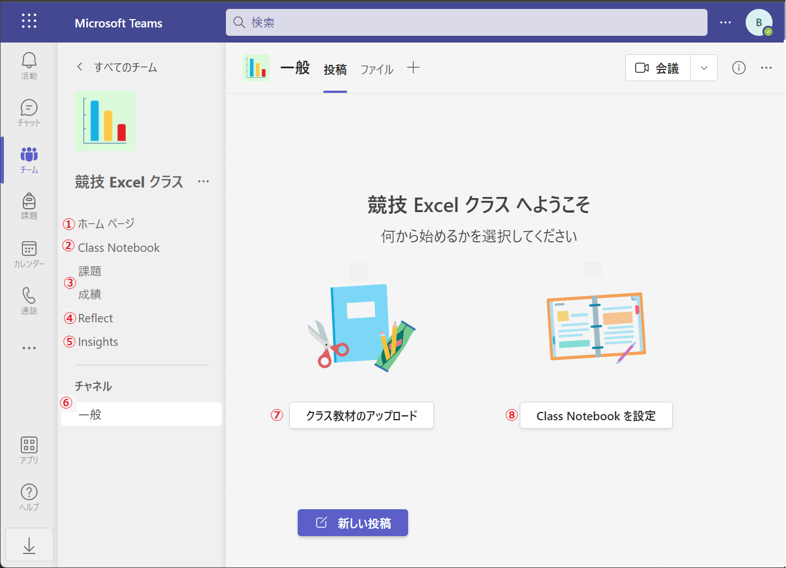
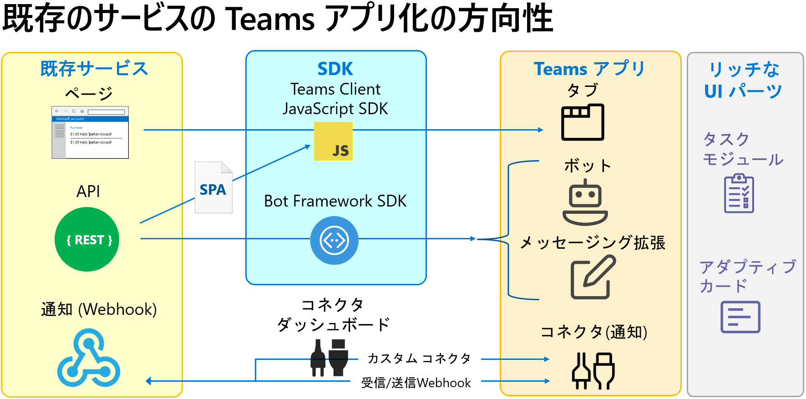

# Microsoft Teams for Education 用アプリ開発について

Microsoft Teams for Education は、教育機関むけに提供される Microsoft Teams であり、標準の Teams にはない、クラス運営やリモート授業、テストといった教育業務のための機能が追加されています。

Microsoft Teams for Education 向けのアプリ開発や、機能連携を行う場合には、Microsoft Teams for Education **ならでは**の機能を把握し、利用することで重複する機能の開発を回避し、かつ効率的な開発を行うことできます。

## Microsoft Teams for Education の構造

ベースとなっている Microsoft Teams そのものが、機能へのエントリーポイントといった構造となっており、Microsoft 365 のさまざまなサービスを組み合わせて Microsoft Teams の機能を実現しています。

たとえば、チャネルやチャットに投稿されるファイルの格納場所は [OneDrive](https://www.microsoft.com/ja-jp/microsoft-365/onedrive/online-cloud-storage) や [SharePoint](https://www.microsoft.com/ja-jp/microsoft-365/sharepoint/collaboration) が使用されており、会議のメモやチャネルのノートには [OneNote](https://www.microsoft.com/ja-jp/microsoft-365/onenote/digital-note-taking-app) が使用されます。

これは Microsoft Teams for Education に追加された教育業務に特化した機能も同様ですが、一部、完全に Microsoft Teams for Education のために用意された固有の機能も存在します。

よって、Microsoft Teams for Education の機能的な構造は、以下のようになっています。

|Microsoft Teams for Education の機能|
| ---- |
|[Microsoft Teams の機能](https://docs.microsoft.com/ja-jp/graph/api/resources/teams-api-overview?view=graph-rest-1.0)|
|[Microsoft Teams for Education 固有の機能](https://docs.microsoft.com/ja-jp/graph/api/resources/education-overview?view=graph-rest-1.0)|
|他の Microsoft 365 サービスの機能|

これらの機能提供元の違いは、外部のアプリケーションから Microsoft Graph API を使用して Teams を操作使用とする際に関係してきます。

たとえば、[*Teams のチャネルにファイルを添付したメッセージを投稿する](https://github.com/osamum/Firstway_to_MSTeamsGraphAPI/blob/master/Ex05.md)といったアクションを実装する場合、以下の処理を順番に行う必要があります。

1. [Microsoft Authentication Library (MSAL)](https://docs.microsoft.com/ja-jp/azure/active-directory/develop/msal-overview) を使用してアクセストークンを入手

2. 入手したトークンを使用して [Drive/DriveItem の Graph API](https://docs.microsoft.com/ja-jp/graph/api/resources/onedrive?view=graph-rest-1.0) を呼び出し、ファイルを OneDrive か SharePoint にファイルにアップロード

3. ファイル アップロードの際に返された JSON 内の eTag 要素の値を [Teams の chatMessage](https://docs.microsoft.com/ja-jp/graph/api/chatmessage-post?view=graph-rest-1.0&tabs=http) に含めてメッセージと紐づけし、Graph API を使用して投稿 

このように Teams の操作ではひとつのアクションに見えるものでも、複数のサービスの機能が組み合わされて実装されています。
  

## Microsoft Teams と Teams for Education の違い

Microsoft Teams for Education では、教職員が新しくチームを作成する場合に、あらかじめ 4 種類のテンプレートが用意されており、利用用途に合わせてテンプレートを選択しチームを作成します。

この 4 つのチームの役割と用途の違いについては以下のドキュメントをご覧ください。

* [**Microsoft Teams で共同作業を行うチームの種類を選択する**](https://support.microsoft.com/ja-jp/topic/microsoft-teams-%E3%81%A7%E5%85%B1%E5%90%8C%E4%BD%9C%E6%A5%AD%E3%82%92%E8%A1%8C%E3%81%86%E3%83%81%E3%83%BC%E3%83%A0%E3%81%AE%E7%A8%AE%E9%A1%9E%E3%82%92%E9%81%B8%E6%8A%9E%E3%81%99%E3%82%8B-0a971053-d640-4555-9fd7-f785c2b99e67)

上記 4 つのチームは用途に合わせ、追加するメンバーの権限や役割、タブとして表示されるプリセットされる機能に違いがあります。

中でも、[**クラス**](https://support.microsoft.com/ja-jp/topic/%E3%82%AF%E3%83%A9%E3%82%B9-%E3%83%81%E3%83%BC%E3%83%A0%E3%81%A7%E5%A7%8B%E3%82%81%E3%82%8B-6b5fd708-35b9-4caf-b66e-d8f2468e4fd5) のテンプレートを使用して生成されるチームは他の 3 のチームとは大きく異なり、Microsoft Teams for Education 固有の機能が複数組み込まれています。

また、固有の機能であるだけに **クラス** は Graph API も[個別のもの](https://docs.microsoft.com/ja-jp/graph/api/resources/educationclass?view=graph-rest-1.0)が提供されています。

以下は **クラス** に既定で提供される機能と機能の提供元サービスです。

| 機能 | 提供元 |
| ---- |---- |
| ① ホームページ| [SharePoint](https://docs.microsoft.com/ja-jp/graph/api/resources/sharepoint?view=graph-rest-1.0) |
| ② Class Notebook| [OneNote](https://docs.microsoft.com/ja-jp/graph/api/resources/onenote-api-overview?view=graph-rest-1.0)|
| ③ 課題/成績 | [Microsoft Teams for Education 固有](https://docs.microsoft.com/ja-jp/graph/api/resources/educationsubmission?view=graph-rest-1.0)|
| ④ Reflect| [Microsoft Reflect](https://reflect.microsoft.com/)|
| ➄ Insights | Microsoft Teams for Education 固有|
| ⑥ チャネル | [Microsoft Teams](https://docs.microsoft.com/ja-jp/graph/api/resources/channel?view=graph-rest-1.0) |
| ➆ クラス教材のアップロード| [SharePoint](https://docs.microsoft.com/ja-jp/graph/api/resources/onedrive?view=graph-rest-1.0) |
| ⑧ Class Notebook を設定 | [OneNote](https://docs.microsoft.com/ja-jp/graph/api/resources/onenote-api-overview?view=graph-rest-1.0)|

さらに細かな機能では、[ルーブリック](https://support.microsoft.com/ja-jp/topic/microsoft-teams%E3%81%A7%E3%83%AB%E3%83%BC%E3%83%96%E3%83%AA%E3%83%83%E3%82%AF%E3%81%AE%E6%8E%A1%E7%82%B9%E3%82%92%E4%BD%9C%E6%88%90%E3%81%8A%E3%82%88%E3%81%B3%E7%AE%A1%E7%90%86%E3%81%99%E3%82%8B-68292a5f-f582-4a41-8ba3-8c96288ec5ca)や[クイズ](https://support.microsoft.com/ja-jp/topic/microsoft-teams%E3%82%92%E9%80%9A%E3%81%98%E3%81%A6%E5%AD%A6%E7%94%9F%E3%81%AB%E3%82%AF%E3%82%A4%E3%82%BA%E3%82%92%E5%89%B2%E3%82%8A%E5%BD%93%E3%81%A6%E3%82%8B-61524815-f5fd-4dc1-961d-dc8e680e7ab0) といったものがあり、Teams ポリシーにも [教育機関向け](https://docs.microsoft.com/ja-jp/microsoftteams/policy-packages-edu) のものが用意されています。

このチュートリアルでは、Microsoft Teams for Education ならではの機能を利用した開発について紹介します。

一般的な Microsoft Teams アプリ開発については以下のチュートリアルをご参照ください。

* [**Microsoft Teams 開発者向け簡易チュートリアル**](https://github.com/osamum/Easyway-for-MSTeamsAppDev)

また同様に Microsoft Graph API の一般的な使い方については以下のチュートリアルご参照ください。

* [**Microsoft Graph API を使用するための簡易チュートリアル**](Firstway_to_MSTeamsGraphAPI)

  

## Microsoft Teams for Education と既存サービスとの連携

Microsoft Teams for Education と既存サービスを連携する方法は大まかに以下の 2 つがあります。

1. [**Microsoft Graph API を使用した部分的な連携**](#1-microsoft-graph-api-%E3%82%92%E4%BD%BF%E7%94%A8%E3%81%97%E3%81%9F%E9%83%A8%E5%88%86%E7%9A%84%E3%81%AA%E9%80%A3%E6%90%BA)
2. [**Teams アプリ化による機能統合**](#2-teams-%E3%82%A2%E3%83%97%E3%83%AA%E5%8C%96%E3%81%AB%E3%82%88%E3%82%8B%E6%A9%9F%E8%83%BD%E7%B5%B1%E5%90%88)

上記 2 つの方法についてそれぞれ概要を説明します。なお、このチュートリアルでは、ハンズオンを通して 2 つの開発方法を体験いただけます。

### 1. Microsoft Graph API を使用した部分的な連携

Microsoft Graph API は Office 365 のような Microsoft 365 に含まれるさまざまサービスを、アプリケーションのリソースとして利用するための仕組みを提供します。この Microsoft Graph API には [Microsoft Teams for Education 固有のリソース](https://docs.microsoft.com/ja-jp/graph/api/resources/education-overview?view=graph-rest-1.0)も含まれており、さまざまな開発言語の SDK や REST API のエンドポイントを介して利用することができます。

Microsoft Teams for Education を Graph API を介して操作することで、既存のサービスやアプリケーション側からの Microsoft Teams for Education リソースの操作が可能になります。

たとえば、既存のアプリケーションから　Microsoft Teams for Education　の課題を作成したり、提出された課題に対して採点し、フィードバックを返す、といったことも可能です。

### 2. Teams アプリ化による機能統合

Microsoft Teams はアプリケーションとしての機能だけではなく、アプリをホストするためのプラットフォームとしての機能も提供します。このプラットフォームで動作するアプリを Teams アプリと言います。

Teams アプリの形態には、タブ アプリ、ボット アプリ、メッセージング拡張やコネクターといったものがありますが、既存のサービスを統合する場合は、サービス側が画面や API を Teams プラットフォームの仕様に準じた形態で提供する必要があります。

たとえば、既存のサービスが Web のページ (UI) を提供していれは Teams タブ アプリに、REST API であれば、それをバックエンド サービスとして利用したボットやメッセージ拡張を開発できますし、Teams のチャネル側から Webhook 用のエンドポイントを払い出して受信 Webhook を、または既存のサービス側で Webhook のエンドポイントが用意されていればチャット画面からそれを呼び出す送信 Webhook も作成できます。

  

## 既存サービスとの機能連携の方向性

ここまでの説明から、機能連携の方向性としては以下のようになります。

| 連携方法 | 機能連携の方向性 |
| ---- |---- |
| Graph API の使用 | 既存サービスから ⇒ Teams |
| Teams アプリ化 | Teams ⇒ 既存サービス |
| Teams アプリ化して Graph API も使用 | 双方向 |

このチュートリアルでは、演習 1) で、Graph API を使用した Microsoft Teams for Education リソースの一覧の取得や参照、新規作成といった機能を SPA (Single Page Application) として実装し、演習 2) で、同 SPA を　Microsoft Teams との SSO (Single Sign On) の機能を持ち、Graph API を使用して Teams for Education のリソースを操作するタブ アプリケーションを作成します。

この 2 つの演習を完了することにより、Microsoft Teams for Education と既存のサービスを連携するための具体的な手順や知識を身に着けることができます。

  

_ _ _
👉 [**準備) 演習に入る前の準備 - 操作するリソースの作成**](Ex00.md)へ

[**戻る**](Readme.md) 👈

