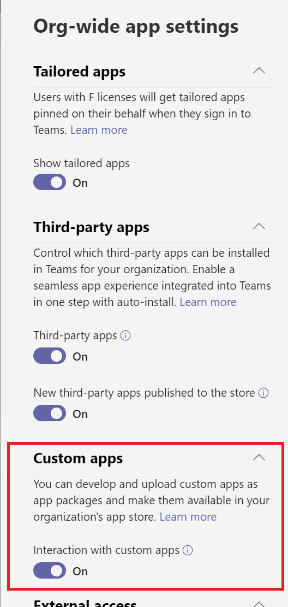

# Microsoft Teams Education 開発者向け簡易チュートリアル
## 概要
このチュートリアルは、これから Microsoft Teams Education 向けのアプリケーションの開発を行う初学者のための簡易的なものであり、実際の開発に取り掛かるまでの学習期間の短縮を目的としています。

ここで紹介するのは以下の内容です。
* 開発で使用する Microsoft Teams Education とスタンダードな Microsoft Teams の違いについて 
* Microsoft Teams Education 固有のオブジェクトの操作方法
* Teams タブ アプリとしての統合方法

チュートリアルとして開発方法を説明するものは以下のチュートリアルに含まれない Teams Education 固有のオブジェクトの操作方法についてです。

* [**Microsoft Teams 開発者向け簡易チュートリアル**](https://github.com/osamum/Easyway-for-MSTeamsAppDev)
* [**Microsoft Graph API を使用するための簡易チュートリアル**](https://github.com/osamum/Firstway_to_MSTeamsGraphAPI)

上記のチュートリアルをあらかじめ履修しておくと演習をスムーズに進めることができますが、本チュートリアルを学習したあとで得た知識をより掘り下げるために後から実施していただいてもかまいません。

## 要件
このチュートリアルを実施するには以下の環境が必要です。

* **Microsoft Office 365 Educationの[ライセンス](https://www.microsoft.com/ja-jp/education/products/office)**

     認定教育機関に所属する学生と教育者の方は、Word、Excel、PowerPoint、OneNote、Microsoft Teams、その他教室ツールを含め、Office 365 for Educationに無償でサインアップできます。

    詳しくは以下のドキュメントをご参照ください。

    * [Microsoft 365 Educationサブスクリプションの学術資格を確認する](https://docs.microsoft.com/ja-jp/microsoft-365/commerce/subscriptions/verify-academic-eligibility?view=o365-worldwide)

* **Microsoft Teams 管理センターでサイドローディングの許可**

    Microsoft Teams 管理センターにて、開発したアプリケーションがサイドローディングできるように許可を行ってください。
    
    具体的には [Microsoft Teams 管理センター (英:Microsoft Teams admin center)](https://admin.teams.microsoft.com/)のメニュー\[**Teams のアプリ**(英:Teams apps)\] - \[**アプリの管理**(英:Manage Apps)\] の画面内にある \[**組織全体のアプリ設定**(英:Org-wide app settings)\] ボタンをクリックし、表示されたブレード内の 「**カスタム アプリ**(英:Custom apps)」をオンにします。

    

    画面下部にある \[**保存**(英:Save)\] ボタンをクリックして設定を保存してください。


* **[Visual Studio 2018 以上のエディション](https://visualstudio.microsoft.com/ja/vs/)、もしくは [Visual Studio Code](https://code.visualstudio.com/Download)**

    全体のコーディング作業で使用します。


* [**Node.js**](https://nodejs.org/en/)

   演習で使用するサンプル アプリケーションをホストするのに使用します。

    また、Visual Studio Code を使用する場合は、ローカル環境で Web サーバーを動かすために以下のコマンドを使用して http-server をインストールしてください。

    ```
    npm install http-server -g
    ```

* **デスクトップ版 Microsoft Teams**

    アプリケーションの登録を行うにはデスクトップ版の Microsoft Teams が必要です。[Office 365 ポータル](https://www.office.com/?)からインストールしておいてください。

* **[ngrok](https://ngrok.com/download)**

    ローカル環境で動作させた開発中のアプリケーションをインターネットを介して一時的にアクセスできるようにするために使用します。

    また Node.js が使用可能な場合は、以下のコマンドを使用してインストールすることも可能です。

    ```
    npm install ngrok -g
    ```

<br />

## 目次
1. [**Microsoft Teams Education 用アプリ開発について**](Intro.md)
    - [準備) 演習に入る前の準備 - 操作するリソースの作成](Ex00.md)
2. [演習1 ) Graph API を使用した Teams for Education の操作](Ex01.md)
    1. Teams for Education 固有のオブジェクトの列挙とドリル ダウン
    2. Teams for Education 固有のオブジェクトの新規作成
    3. Teams for Education 固有のオブジェクトの操作
    4. Teams for Education を操作する Single Page Application の作成
3. 演習2) Teams タブ アプリの作成 
    1. SSO とパーソナルタブ アプリの作成
    2. チーム (構成可能) タブ アプリの作成